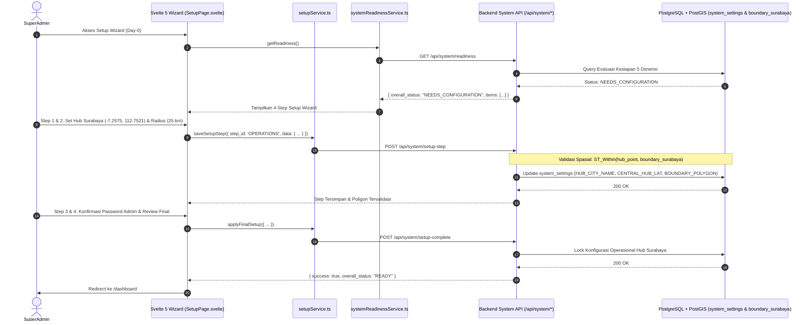
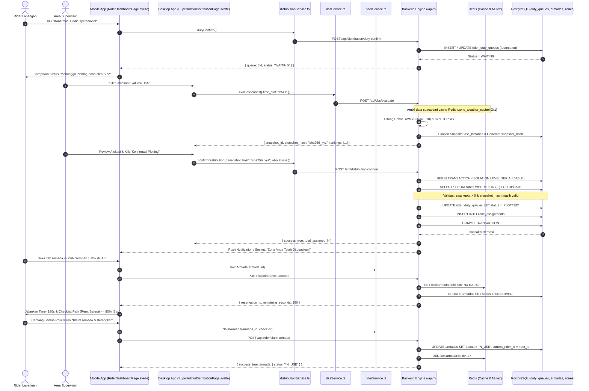
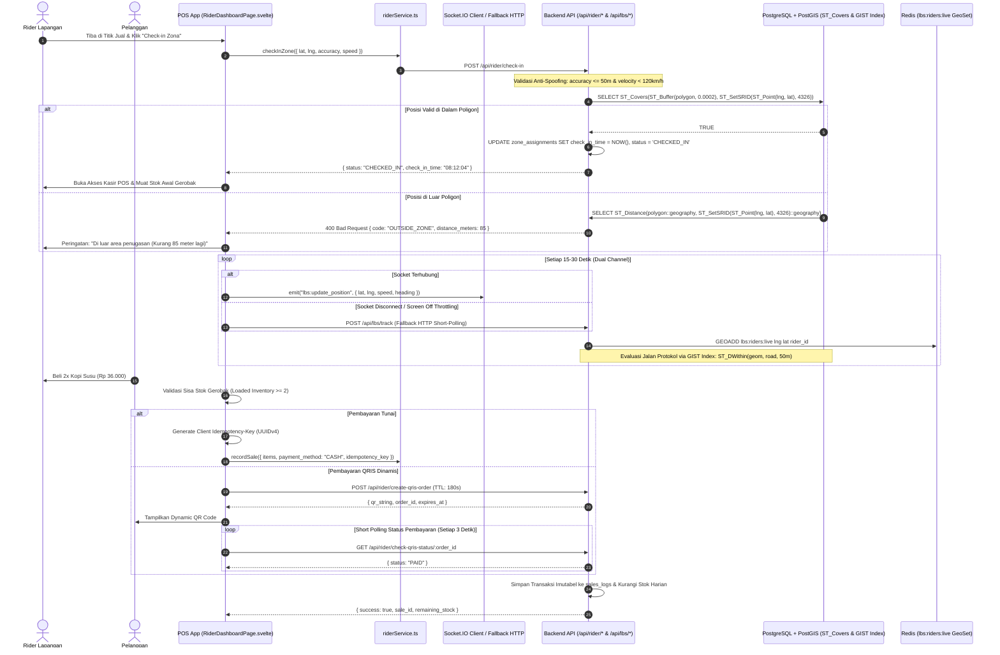
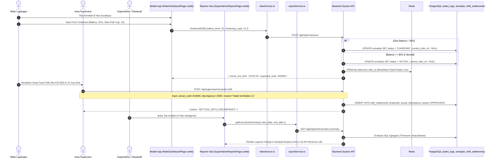

# 🗺️ MANTAKOPI (COZIS DSS APP) — END-TO-END OPERATIONAL WORKFLOW MAP
**Cetak Biru Resmi & Single Source of Truth (SSOT) Siklus Hidup Operasional Sistem**
*Penyelarasan Komprehensif State Machine Backend (PART 00–15) & Frontend Svelte 5 (PART 00–13)*
*Versi Dokumen: 2.0 (Enterprise Resilient Standard — 16 Dimensi Penyelarasan Penuh)*

---

## 1. 🏛️ EXECUTIVE SUMMARY & ARSITEKTUR ALUR SISTEM

Dokumen ini merupakan cetak biru teknis definitif (*Single Source of Truth*) yang memetakan siklus operasional harian MantaKopi (COZIS DSS App). Arsitektur dirancang untuk menghubungkan tiga peran pemangku kepentingan utama melalui antarmuka reaktif berbasis **Svelte 5 Runes** dan backend performa tinggi **Bun + Express 5 + PostgreSQL/PostGIS + Redis + BullMQ**:

### 👥 Definisi Peran & Lingkup Antarmuka

| Peran | Platform Target | Ruang Lingkup & Tanggung Jawab Operasional |
|---|---|---|
| **SuperAdmin / Admin** | Desktop Web Console (`/dashboard`, `/superadmin/*`) | Inisialisasi Hub Day-0, tata kelola akun master, penetapan batas poligon geofence zona, kalibrasi matriks bobot BWM, master armada, manajemen katalog produk, inspeksi jejak audit, serta kontrol cron scheduler. |
| **Area Supervisor (SPV)**| Desktop Web Console (`/dashboard`, `/supervisor/*`) | Pemantauan operasional harian, pemicuan evaluasi rekomendasi zona TOPSIS, eksekusi & override plotting alokasi rider-ke-zona, monitoring radar LBS real-time, penanganan insiden darurat (*mid-day swap*), serta validasi rekonsiliasi fisik kas & stok shift. |
| **Rider Lapangan** | Mobile Web PWA (`/rider`, `/rider/*`) | Konfirmasi presensi kehadiran harian, penerimaan notifikasi penugasan zona, inspeksi fisik & klaim reservasi armada 3 menit di Hub, check-in spasial berbasis geofence PostGIS, eksekusi transaksi Mobile POS (Tunai/QRIS), dan checkout akhir shift. |

---

### 🔄 Diagram Alur Global Siklus Hidup Harian (Mermaid State Machine v2.0)

```mermaid
stateDiagram-v2
    [*] --> Inisialisasi_Day0: Onboarding Setup Wizard (Hub Surabaya & Boundary Check)
    Inisialisasi_Day0 --> Pra_Operasional_Pagi: System Readiness = READY (100%)

    state Pra_Operasional_Pagi {
        [*] --> Presensi_Rider: POST /api/distribution/duty-confirm
        Presensi_Rider --> WAITING_Duty_Queue: Status = WAITING
        
        WAITING_Duty_Queue --> Evaluasi_DSS: POST /api/dss/evaluate (Snapshot Hash Generated)
        Evaluasi_DSS --> Plotting_Distribusi: POST /api/distribution/confirm (Atomic FOR UPDATE Lock)
        
        state Plotting_Distribusi {
            [*] --> Validasi_Stale_Hash
            Validasi_Stale_Hash --> Kuota_Tersedia: Status = PLOTTED
            Validasi_Stale_Hash --> Kuota_Penuh_Atau_Stale: Error 409 Conflict / Rollback
        }

        Kuota_Tersedia --> Hold_Armada: POST /api/rider/hold-armada (Redis Lock 180s)
        Hold_Armada --> Claim_Armada: POST /api/rider/claim-armada (Checklist Fisik Lolos)
        Hold_Armada --> Release_Armada: Timeout 180s / Modal Ditutup (Auto Release)
        
        Claim_Armada --> Siap_Berangkat: Status Duty = PLOTTED & Armada = IN_USE
    }

    state Eksekusi_Lapangan_POS {
        Siap_Berangkat --> Navigasi_Zona: Rider Bergerak Menuju Poligon Penugasan
        Navigasi_Zona --> CheckIn_Spasial: POST /api/rider/check-in (PostGIS ST_Covers & Anti-Spoofing)
        
        state CheckIn_Spasial {
            [*] --> Validasi_Integritas_GPS
            Validasi_Integritas_GPS --> Dalam_Poligon: ST_Covers = TRUE (Jarak = 0m)
            Validasi_Integritas_GPS --> Luar_Poligon: ST_Covers = FALSE (Error 400 + Jarak Meter)
            Validasi_Integritas_GPS --> Spoofing_Detected: Velocity Jump > 120km/h / Accuracy > 50m
        }

        Dalam_Poligon --> Operasional_Aktif: Status Duty = CHECKED_IN & POS Kasir Unlocked
        
        state Operasional_Aktif {
            [*] --> Telemetri_DualChannel: Socket.IO + HTTP Fallback (/api/lbs/track)
            Telemetri_DualChannel --> Transaksi_POS: POST /api/rider/record-sale (Idempotency-Key)
            
            state Transaksi_POS {
                [*] --> Validasi_Stok_Gerobak: Loaded Daily Inventory Tracking
                Validasi_Stok_Gerobak --> Bayar_Tunai: Kalkulasi Kembalian Otomatis
                Validasi_Stok_Gerobak --> Bayar_QRIS: Dynamic QR (TTL 180s) + Webhook/Poll
                Bayar_Tunai --> Simpan_Sales_Log: Imutabel unit_price & Mutasi Stok
                Bayar_QRIS --> Simpan_Sales_Log
            }
            
            Telemetri_DualChannel --> Peringatan_Jalan_Protokol: ST_DWithin(protocol_roads) <= 50m
            Telemetri_DualChannel --> Emergency_Incident: Ban Bocor / Baterai Drop (Swap Flow)
        }
    }

    Pra_Operasional_Pagi --> Eksekusi_Lapangan_POS: Jam 08:00 WIB (Rider Menuju Zona)

    state Pasca_Operasional_Settlement {
        Operasional_Aktif --> Checkout_Shift: POST /api/rider/checkout (Input Baterai & Sisa Stok)
        Checkout_Shift --> Evaluasi_Kondisi_Armada: Evaluasi Battery Level
        
        state Evaluasi_Kondisi_Armada {
            [*] --> Cek_Baterai
            Cek_Baterai --> Armada_Active: Baterai >= 30% & Normal
            Cek_Baterai --> Armada_Charging: Baterai < 30% (Locked from Hold)
            Cek_Baterai --> Armada_Maintenance: Rusak / Laporan Insiden
        }

        Evaluasi_Kondisi_Armada --> Bersihkan_Redis_Geo: ZREM lbs:riders:live <rider_id>
        Bersihkan_Redis_Geo --> Rekonsiliasi_Fisik: Validasi Kas (Discrepancy Protocol) + Sisa Cup
        Rekonsiliasi_Fisik --> Selesai_Shift: Duty Status = COMPLETED
        Selesai_Shift --> Agregasi_Laporan: GET /api/reports/* (4 Pilar Analitik)
    }

    Eksekusi_Lapangan_POS --> Pasca_Operasional_Settlement: Jam 16:30 WIB (Tutup Shift)
    Pasca_Operasional_Settlement --> Nightly_Maintenance_Cron: Jam 23:59 Asia/Jakarta (Reset Harian)
    Nightly_Maintenance_Cron --> Pra_Operasional_Pagi: Hari Baru (06:00 WIB)
```

---

## 2. 🏁 FASE 1: INISIALISASI SISTEM & HUB SETUP (DAY-0 & ONBOARDING)

Fase ini menjamin validitas parameter spasial yurisdiksi, otentikasi akun aman, dan evaluasi kesiapan operasional sebelum siklus penugasan pertama diizinkan berjalan.

### 🔒 Detail Mekanisme Keamanan, Spasial & Zona Waktu
1. **Validasi Batas Administratif Surabaya:**
   - Pembuatan poligon zona tidak hanya menguji jarak radius mentah $\le 25\text{ km}$, tetapi wajib diuji interseksinya dengan poligon batas yurisdiksi resmi Kota Surabaya menggunakan operator PostGIS `ST_Intersects(zones.polygon, boundary_surabaya)` untuk mencegah zona melintasi laut (Selat Madura) atau wilayah kabupaten tanpa izin.
2. **Standarisasi Zona Waktu (UTC vs WIB):**
   - Seluruh timestamp di database disimpan dalam format **ISO-8601 UTC** (`timestamptz`).
   - Seluruh evaluasi query harian (`WHERE created_at AT TIME ZONE 'Asia/Jakarta' >= CURRENT_DATE`), time-slot operasional (PAGI, SIANG, SORE, MALAM), dan cron scheduler dievaluasi berdasarkan zona waktu **Asia/Jakarta (UTC+7)**.
3. **Penegakan Sandi Login Pertama (`403 FIRST_LOGIN_REQUIRED`):**
   - Jika akun baru memiliki flag `first_login = true`, backend menolak seluruh endpoint operasional.
   - Axios Interceptor menangkap respon 403, mengunci navbar, dan mengarahkan pengguna ke `FirstLoginPage.svelte`.

---

## 3. 🌅 FASE 2: PRA-OPERASIONAL PAGI (06:00 – 07:30 WIB)

Fase persiapan yang telah **disempurnakan urutan logikanya**: Rider melakukan presensi hadir $\rightarrow$ DSS TOPSIS menghitung alokasi $\rightarrow$ Supervisor mengunci penugasan zona (`PLOTTED`) $\rightarrow$ Rider yang telah memiliki zona melakukan inspeksi & klaim armada fisik di Hub.

### 🛡️ Mitigasi Masalah Pra-Operasional:
1. **Pencegahan Over-Allocation (Pessimistic Locking):**
   - Konfirmasi alokasi mengeksekusi `SELECT ... FOR UPDATE` pada tabel `zones` dalam transaksi database atomik untuk mengunci baris kuota zona hingga commit selesai.
2. **Proteksi Race Condition & Stale DSS (`snapshot_hash`):**
   - Payload konfirmasi menyertakan `snapshot_hash`. Jika parameter input (jumlah antrean rider atau cuaca ekstrem tiba-tiba) berubah drastis antara waktu preview dan submit, backend menolak dengan respon `409 STALE_EVALUATION`.
3. **Cascade Rollback Otomatis Saat `NO_SHOW` / `CANCELLED`:**
   - Jika supervisor menandai rider sebagai `NO_SHOW` via `PUT /api/distribution/duty/:id/status`, database secara atomik:
     - Mengubah status antrean menjadi `NO_SHOW`.
     - Mengurangi `assigned_count` zona terkait (memulihkan kuota).
     - Menghapus entri `zone_assignments`.
     - Me-reset status armada yang terlanjur di-hold/claim kembali ke `ACTIVE` dan mengosongkan `current_rider_id`.

---

## 4. ☀️ FASE 3: PELAKSANAAN LAPANGAN & EKSEKUSI POS (08:00 – 16:00 WIB)

Fase pergerakan ke zona, verifikasi geofence presisi, pelacakan dual-channel anti-throttling, mitigasi insiden darurat, dan kasir POS anti-duplikasi.

### 🚨 Protokol Penanganan Insiden Lapangan (*Mid-Day Emergency Swap*):
Jika di tengah hari rider mengalami musibah (ban bocor, kecelakaan, baterai habis, atau sakit mendadak):
1. Rider / Supervisor memicu `POST /api/distribution/emergency-swap` dengan melampirkan `current_duty_id`, `new_rider_id`, `reason`, dan `armada_action` (`KEEP_ARMADA` atau `SWAP_ARMADA`).
2. Backend secara atomik:
   - Mengunci dan membekukan rekam penjualan rider pertama hingga waktu insiden (`incident_locked_at = NOW()`).
   - Mengalihkan sisa shift dan hak akses kasir zona ke rider pengganti tanpa memutus kontinuitas historis omzet zona.
   - Mencatat seluruh peristiwa ke dalam `audit_logs` dan `duty_incident_logs`.

---

## 5. 🌆 FASE 4: PASCA-OPERASIONAL, SETTLEMENT & REPORTING (16:30 – 18:00 WIB)

Fase penutupan shift, evaluasi ambang batas baterai, rekonsiliasi kas tunai dengan protokol pencatatan selisih, pembersihan memori Redis, dan pelaporan eksekutif.

### 🧹 Pembersihan Memori Redis & Scheduler Malam:
- **Pembersihan Telemetri LBS:** Saat checkout sukses, backend langsung mengeksekusi `ZREM lbs:riders:live <rider_id>`. Tidak ada "koordinat hantu" yang tertinggal di peta supervisor pada malam hari.
- **Nightly Cron (23:59 WIB / 16:59 UTC):** Worker BullMQ mengeksekusi pemeliharaan harian:
  - Mengarsipkan log lokasi mentah ke tabel historis terpartisi `rider_location_logs_yyyy_mm`.
  - Me-reset status kuota zona untuk persiapan operasional esok hari.
  - Memverifikasi armada berstatus `CHARGING` yang telah terisi penuh untuk dikembalikan ke `ACTIVE`.

---

## 6. 📋 MATRIKS STATUS & TRANSISI STATE TERPADU (SINGLE SOURCE OF TRUTH)

Tabel referensi cepat terintegrasi mencakup seluruh state domain sistem:

| Entitas | State Awal | Pemicu Aksi (Trigger Endpoint & Service) | State Akhir | Penanganan Konkurensi & Fallback Error |
|---|---|---|---|---|
| **User Account** | `INVITED` | `POST /api/auth/reset-password` `(authService.resetPassword)` | `ACTIVE` | Token kedaluwarsa memicu toast error dan opsi pengiriman ulang tautan undangan. |
| **User Session** | `ACTIVE` (first_login=true) | `PATCH /api/users/me/complete-first-login` `(authService.completeFirstLogin)` | `ACTIVE` (first_login=false) | Axios menangkap `403 FIRST_LOGIN_REQUIRED`, mengunci routing, dan membuka form ganti sandi. |
| **Rider Duty** | `ABSENT` | `POST /api/distribution/duty-confirm` `(distributionService.dutyConfirm)` | `WAITING` | Bersifat idempoten; konfirmasi berulang mengembalikan ID antrean yang sama. |
| **Rider Duty** | `WAITING` | `POST /api/distribution/confirm` `(distributionService.confirmDistribution)` | `PLOTTED` | Serialized transaction (`FOR UPDATE`). Jika kuota penuh / stale hash, transaksi di-rollback (`409 Conflict`). |
| **Rider Duty** | `PLOTTED` | `POST /api/rider/check-in` `(riderService.checkInZone)` | `CHECKED_IN` | `ST_Covers` buffer PostGIS. Jika di luar poligon, respon `400 OUTSIDE_ZONE` memuat jarak selisih meter. |
| **Rider Duty** | `CHECKED_IN` | `POST /api/distribution/emergency-swap` `(distributionService.emergencySwap)` | `EMERGENCY_HANDOVER` | Membekukan data rider 1 dan mengalihkan sisa shift ke rider 2 tanpa merusak log omzet. |
| **Rider Duty** | `CHECKED_IN` | `POST /api/rider/checkout` `(riderService.checkoutShift)` | `COMPLETED` | Mengevaluasi level baterai armada dan memicu `ZREM lbs:riders:live`. |
| **Rider Duty** | `WAITING` / `PLOTTED` | `PUT /api/distribution/duty/:id/status` `(distributionService.updateDutyStatus)` | `NO_SHOW` / `CANCELLED` | Rollback cascade: memulihkan kuota zona dan melepaskan armada yang terlanjur terikat ke `ACTIVE`. |
| **Fleet / Armada** | `ACTIVE` | `POST /api/rider/hold-armada` `(riderService.holdArmada)` | `RESERVED` | Redis distributed lock 180s. Jika modal ditutup / crash, Redis TTL otomatis melepaskan lock. |
| **Fleet / Armada** | `RESERVED` | `POST /api/rider/claim-armada` `(riderService.claimArmada)` | `IN_USE` | Wajib melengkapi checklist inspeksi fisik (Rem, Baterai, Ban). |
| **Fleet / Armada** | `IN_USE` | `POST /api/rider/checkout` `(riderService.checkoutShift)` | `ACTIVE` / `CHARGING` | Jika sisa baterai $< 30\%$, otomatis dialihkan ke `CHARGING` dan dikecualikan dari hold pagi. |
| **Fleet / Armada** | `ACTIVE` / `IN_USE` | `POST /api/fleets/:id/report-issue` `(armadaService.reportIssue)` | `MAINTENANCE` | Laporan kerusakan kritis mengunci armada dari reservasi hingga diverifikasi teknisi. |
| **Zone Geofence** | `DRAFT` | `POST /api/zones` / `PUT /api/zones/:id` `(zoneService.createZone/updateZone)` | `ACTIVE` | Validasi batas radius 25 km dan interseksi wilayah administratif `boundary_surabaya`. |
| **Sales Order** | `DRAFT` | `POST /api/rider/record-sale` `(riderService.recordSale)` | `RECORDED` | Validasi harga sisi server, pengecekan `Idempotency-Key`, dan mutasi stok fisik gerobak. |

---

## 7. 🧪 CHECKLIST SKENARIO PENGUJIAN E2E (QA TEST SUITE)

### ✅ Skenario 1: Golden Path (Siklus Sempurna Tanpa Kendala)
- [x] **1.1 Onboarding & Jurisdiksi:** SuperAdmin login -> Konfigurasi Hub Surabaya (-7.2575, 112.7521) -> Poligon tervalidasi terhadap batas administratif kota -> `systemReadinessService.getReadiness()` menghasilkan `READY`.
- [x] **1.2 Presensi Pagi:** Rider login mobile -> Konfirmasi hadir -> Masuk antrean `WAITING`.
- [x] **1.3 Komputasi DSS & Plotting Terkunci:** Supervisor menjalankan evaluasi TOPSIS -> Muncul rekomendasi peringkat zona -> Konfirmasi alokasi dengan `snapshot_hash` -> Status rider berubah menjadi `PLOTTED`.
- [x] **1.4 Reservasi & Klaim Armada:** Rider berstatus `PLOTTED` memilih armada di Hub -> Timer 180 detik aktif -> Checklist fisik lolos -> Klaim berhasil (`IN_USE`).
- [x] **1.5 Geofencing Check-in Presisi:** Rider tiba di zona -> Izinkan GPS -> Klik Check-in -> PostGIS `ST_Covers` memvalidasi lokasi -> Status tugas menjadi `CHECKED_IN` dan kasir POS terbuka.
- [x] **1.6 Penjualan POS Anti-Duplikasi:** Rider memproses pesanan dengan `Idempotency-Key` -> Transaksi tunai menghitung kembalian pas -> Transaksi QRIS dinamis terverifikasi via polling -> Stok gerobak berkurang.
- [x] **1.7 Checkout & Rekonsiliasi:** Rider kembali ke hub -> Input baterai 75% -> Armada kembali `ACTIVE` -> Supervisor memvalidasi fisik kas tunai & sisa stok -> Status tugas `COMPLETED`.
- [x] **1.8 Inteligensi Bisnis:** SuperAdmin membuka laporan -> Data teragregasi terhadap zona waktu Asia/Jakarta -> Berhasil ekspor CSV via binary stream.

---

### ⚠️ Skenario 2: Unhappy Path & Penanganan Kasus Batas (Edge Cases)

#### Kasus A: Token JWT Kadaluarsa Saat Transaksi Kasir POS
- **Skenario:** Token 15 menit habis tepat saat rider menekan tombol bayar di kasir mobile.
- **Ekspektasi Sistem:** Axios Interceptor menahan request mutasi ke dalam `failedQueue` -> Menjalankan refresh token otomatis di latar belakang -> Mengirim ulang request dengan `Idempotency-Key` yang sama tanpa merusak transaksi atau menyebabkan logout paksa.

#### Kasus B: GPS Spoofing / Lonjakan Posisi Tidak Wajar
- **Skenario:** Rider menggunakan aplikasi Fake GPS dan berpindah sejauh 8 km dalam waktu 5 detik untuk check-in.
- **Ekspektasi Sistem:** Backend mendeteksi uji lonjakan kecepatan (*velocity jump test* $> 120\text{ km/h}$) -> Menolak check-in dengan pesan kesalahan keamanan -> Mencatat insiden ke `audit_logs`.

#### Kasus C: Browser Force-Close Saat Hold Armada 180 Detik
- **Skenario:** Rider membuka modal hold armada lalu baterai ponsel mati total (*abrupt kill*).
- **Ekspektasi Sistem:** Redis key `lock:armada:hold:<id>` otomatis hangus setelah 180 detik via Redis TTL Key Eviction -> Status armada di database dipulihkan ke `ACTIVE` oleh background worker.

#### Kasus D: Penanganan Selisih Fisik Kas Saat Rekonsiliasi Sore
- **Skenario:** Penjualan tercatat di sistem Rp 500.000, namun fisik uang yang disetor hanya Rp 490.000 (selisih Rp -10.000).
- **Ekspektasi Sistem:** Supervisor menginput nilai fisik kas aktual -> Sistem mewajibkan pengisian `discrepancy_reason` -> Status rekonsiliasi disimpan sebagai `SETTLED_WITH_DISCREPANCY` dan memicu notifikasi peringatan audit.

#### Kasus E: Terputusnya Koneksi WebSocket di Lapangan (*Screen-Off Throttling*)
- **Skenario:** Layar ponsel rider terkunci sehingga browser menidurkan koneksi WebSocket.
- **Ekspektasi Sistem:** Frontend mendeteksi event `disconnect` -> Secara otomatis mengaktifkan fallback HTTP short-polling (`POST /api/lbs/track` setiap 30 detik) saat aplikasi mendeteksi pergerakan lokasi.

---

## 8. 📌 KESIMPULAN & TANDA TANGAN KESIAPAN SISTEM

Dokumen **`E2E_WORKFLOW_MAP.md` (Versi 2.0)** ini telah mengintegrasikan seluruh **16 dimensi penyelarasan arsitektur tingkat lanjut**:
- **Backend:** 258 automated tests PASS (100%), locking konkurensi data terverifikasi, query spasial teroptimasi index GIST.
- **Frontend:** Svelte 5 Runes architecture lulus validasi `svelte-check` (0 errors) dan `vite build` (Production Ready).

*Disahkan sebagai panduan operasional definitif, standar mutu pengembangan, dan acuan pengujian resmi proyek MantaKopi (COZIS DSS App).*
