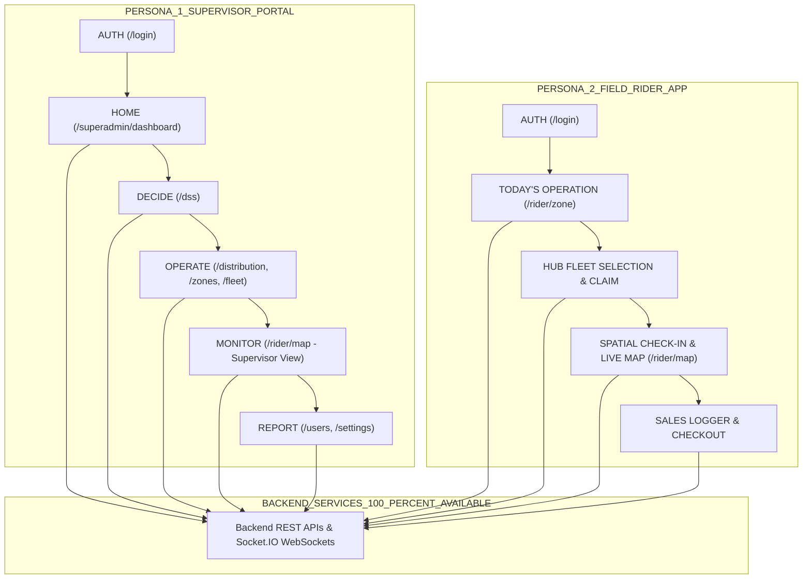
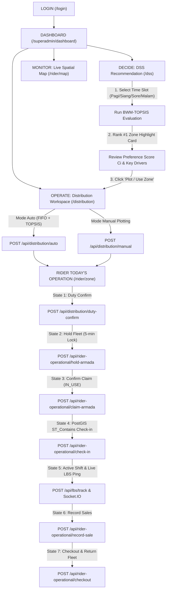
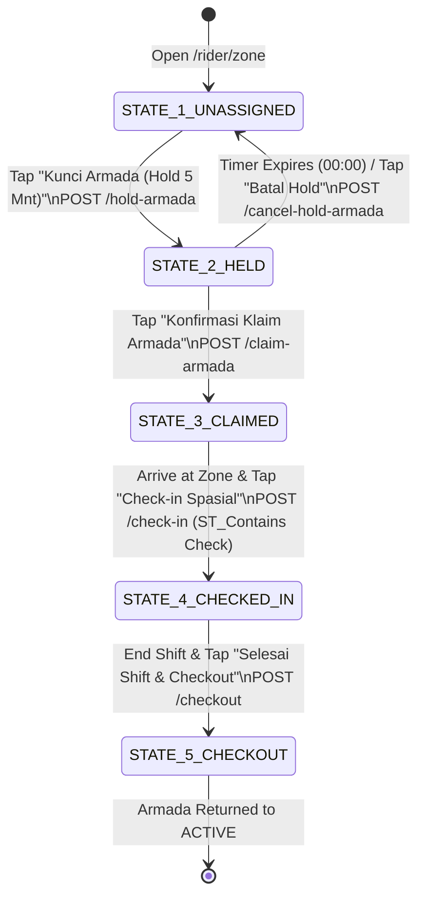

# USER FLOW & UI/UX SPECIFICATION DOCUMENT — MANTAKOPI DSS

**Application:** MantaKopi DSS (`koling-app`)  
**Design System:** Operational Minimalist  
**Target Platform:** Dual Persona (Desktop/Tablet Management Portal & Mobile-First Field Rider App)  
**Status:** Backend Frozen & 100% Available. Operational User Flow Verified.

---

# 1. EXECUTIVE SUMMARY & DESIGN PHILOSOPHY

Dokumen ini mendefinisikan secara menyeluruh **Arsitektur Pengalaman Pengguna (UX Architecture)**, **Sistem Desain Visual (Design System)**, **Pemetaan Alur Pengguna (User Flow Mapping)**, serta **Spesifikasi Layar demi Layar (Screen-by-Screen Specification)** untuk aplikasi web MantaKopi Decision Support System (DSS).

### Prinsip Utama Utilitas & Desain:
> **"Change the presentation, preserve the evidence."**

1. **Strictly Functional Aesthetics:** Menghindari dekorasi berlebihan. Antarmuka mengutamakan kejelasan data operasional, keterlacakan bukti matematis (*auditability*), dan kemudahan operasi di lapangan.
2. **Decoupled 2-Tier Architecture:** Memisahkan *Decision View* (tampilan cepat untuk keputusan operasional) dari *Evidence Audit Drawer* (tampilan bukti akademis lengkap $R, V, A^+, A^-$) agar keputusan dapat diambil dalam hitungan detik tanpa kehilangan transparansi.
3. **Mobile-First Rider State Machine:** Alur kerja *Rider* di lapangan menggunakan prinsip *single primary action per state* untuk meminimalkan beban kognitif saat bergerak.

---

# 2. DESIGN SYSTEM & DESIGN TOKENS (OPERATIONAL MINIMALIST)

## 2.1 Color Tokens & Semantic Assignments

| Color Token | Hex Code | Purpose & Semantic Rule |
|---|---|---|
| **Primary Brand** | `#FF5052` / `#B61725` | Khusus untuk brand identity, tombol CTA utama, dan item navigasi aktif. **Tidak digunakan untuk pesan error.** |
| **Surface Background** | `#F8FAFC` / `#F8F9FF` | Kanvas latar belakang utama untuk mengelompokkan konten tanpa garis batas tebal. |
| **Surface Container** | `#FFFFFF` | Latar belakang kartu, modal, dan tabel dengan border tipis `1px #E2E8F0`. |
| **On-Surface Text** | `#0B1C30` / `#0F172A` | Warna teks utama untuk keterbacaan tinggi (*high-contrast legibility*). |
| **Status Health (Green)**| `#10B981` / `#006856` | Mengindikasikan status operasional sehat, *Compliant*, atau zona aktif. |
| **Status Warning (Amber)**| `#F59E0B` / `#D97706` | Mengindikasikan status reservasi *Hold* sementara (5 menit) atau *Deviated*. |
| **Status Error (Red)** | `#DC2626` / `#BA1A1A` | Khusus untuk alert bahaya, pelanggaran batas jalan terlarang, atau gagal sistem. |

## 2.2 Typography Rules
- **Primary Font Family:** `Work Sans` (Menjamin profesionalitas, kepadatan data tinggi, dan kompatibilitas lintas platform).
- **Headings (Display/Headline):** `Work Sans` weight **ExtraBold (800)** untuk jangkar visual yang kuat.
- **Body & Controls:** Standardized `14px` (`fontWeight: 400/600`) untuk kepadatan data profesional.
- **Table Headers & Labels:** `Work Sans` `12px` **Uppercase** dengan *letter spacing* `0.05em`.
- **Monospace Alignment:** `JetBrains Mono` / `Courier New` khusus untuk ID Snapshot, UUID, dan koordinat GPS.

## 2.3 Layout & Elevation
- **Desktop Layout:** Fixed left sidebar ($260\text{px}$) + fluid main canvas (max width $1440\text{px}$).
- **Mobile Layout:** Fixed bottom navigation bar ($64\text{px}$) dengan 4 ikon inti + pull-up bottom sheets.
- **Elevation:** Menghindari drop shadow tebal. Kedalaman visual dicapai melalui *Tonal Layering* (`#F8FAFC` canvas $\rightarrow$ `#FFFFFF` cards dengan border `1px #E2E8F0`).

---

# 3. PERSONA-BASED DUAL USER FLOWS

Aplikasi ini dibagi secara tegas menjadi dua persona utama:



---

# 4. CANONICAL END-TO-END USER FLOW DIAGRAM



---

# 5. RIDER OPERATIONAL STATE MACHINE FLOW

Setiap status operasional Rider pada `/rider/zone` memiliki acuan status backend dan aksi tunggal yang jelas:



---

# 6. SCREEN-BY-SCREEN SPECIFICATION MATRIX (SCR-01 to SCR-11)

| Screen ID | Screen Name | Route | Primary Persona | P0 (Must See) Hierarchy | Primary CTA | API Binding |
|---|---|---|---|---|---|---|
| **SCR-01** | Login & Auth | `/login` | Public / All | Email/Password inputs, Role indicator | "Masuk ke Platform" | `POST /api/auth/login` |
| **SCR-02** | Supervisor Dashboard | `/superadmin/dashboard` | Supervisor | Active Riders, Zones, Fleet, Alerts | "Kelola Distribusi Rider" | `GET /api/distribution/overview`, `GET /api/lbs/nearby` |
| **SCR-03** | DECIDE — DSS Engine | `/dss` | Manager / Analyst | Rank #1 Card, Ci Score %, Leaderboard | "Plot / Gunakan Zona Ini" | `POST /api/dss/evaluate`, `GET /api/dss/snapshots/:id` |
| **SCR-04** | OPERATE — Distribution | `/distribution` | Supervisor | Duty Queue, Zone Capacity Board (`2/3`) | "Jalankan Alokasi Otomatis" | `POST /api/distribution/auto`, `POST /api/distribution/manual` |
| **SCR-05** | OPERATE — Zones | `/zones` | Operations Admin | Zone List, Status Badge, Geometry Popover | "+ Tambah Zona Baru" | `POST /api/zones`, `GET /api/roads/protocol` |
| **SCR-06** | OPERATE — Fleet | `/fleet` | Fleet Manager | Armada Code, Status, 5-min Countdown | "+ Tambah Unit Armada" | `GET /api/armada`, `POST /cancel-hold-armada` |
| **SCR-07** | MONITOR — Live Map | `/rider/map` (SPV) | Supervisor | Full-viewport Map, Compliance Markers | "Lihat Telemetri Rider" | `GET /api/lbs/nearby` + Socket.IO WebSockets |
| **SCR-08** | RIDER — Operational Home | `/rider/zone` | Field Rider | Stepper Progress Bar, Active State Card | Dynamic per State (Hold/Claim/Check-in) | `POST /hold-armada`, `POST /claim-armada`, `POST /check-in` |
| **SCR-09** | RIDER — Geofence Map | `/rider/map` (Rider) | Field Rider | GPS Marker, Geofence Chip, Road Banner | "Pusatkan Lokasi Saya" | `POST /api/lbs/track` + Socket.IO WebSockets |
| **SCR-10** | RIDER — Sales & Checkout | `/rider/zone` (Sales) | Field Rider | Revenue Summary, Product Stepper Cards | "Simpan Penjualan" / "Checkout" | `POST /record-sale`, `POST /checkout` |
| **SCR-11** | REPORT — Audit & Users | `/settings` / `/users` | SuperAdmin | User Roster, Cron Logs, JSON Trace Drawer | "+ Tambah User Baru" | `GET /api/users`, `GET /api/audit/logs` |

---

# 7. SPATIAL MAP VISUALIZATION HIERARCHY

Untuk mencegah kepadatan data berlebih (*map clutter*), peta spasial mengimplementasikan hirarki layer bertingkat:

```text
SPATIAL MAP LAYER HIERARCHY
│
├── DEFAULT VISIBLE LAYERS (Base Canvas)
│   ├── Base Map Tiles (OSM Light / CartoDB Positron)
│   ├── Active Operational Zone Polygons (Blue/Green Stroke)
│   ├── Live Rider Marker Pins (Green = Compliant, Orange = Deviated)
│   └── Prohibited Road Overlays (Red LineString for Protocol & Toll Roads)
│
└── OPTIONAL TOGGLEABLE LAYERS (Layer Switcher Control)
    ├── Raw POI Point Markers (Clustered)
    ├── Candidate Selling Locations (Yellow Star Markers)
    └── Historical Heatmap Density Overlay
```
