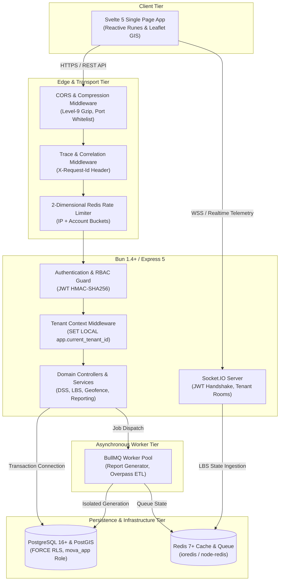

# MOVA Technical Specification: System Architecture & Multi-Tenant RLS

```text
================================================================================
                    MOVA PLATFORM TECHNICAL SPECIFICATION
             01. SYSTEM ARCHITECTURE & MULTI-TENANT ROW-LEVEL SECURITY
================================================================================
```

---

## 1. Purpose

This document provides the authoritative technical and architectural specification for the **MOVA (MantaKopi Operational Vehicle Analytics & DSS)** platform. It establishes the foundational design of MOVA's distributed monolith architecture and details the cryptographic, database-engine, and transactional invariants governing **PostgreSQL Multi-Tenant Row-Level Security (RLS)** and **IDOR/BOLA (Broken Object Level Authorization)** defense.

---

## 2. Scope

* **Architectural Topology**: Backend runtime (Bun + TypeScript + Express 5), Frontend client (Svelte 5 + Vite v8.2.2), Persistence layer (PostgreSQL 16+ with PostGIS), Cache/Queue layer (Redis 7+ and BullMQ v6.0.7), and Real-time communication (Socket.IO).
* **Multi-Tenancy Model**: Shared-Database, Shared-Schema multi-tenancy enforced through PostgreSQL native Row-Level Security (RLS) policies.
* **Security & Access Boundaries**: Role-Based Access Control (RBAC), JSON Web Tokens (JWT), session parameter propagation (`SET LOCAL app.current_tenant_id`), and zero-leak probing defense (`404 Not Found`).

---

## 3. Architecture & High-Level Concept

MOVA operates as a high-throughput, real-time spatial analytics and decision support platform. The system is designed to minimize inter-service network overhead while guaranteeing absolute data partitioning across commercial tenants.



---

## 4. Implementation Details

### 4.1 PostgreSQL Row-Level Security Configuration

Tenant partitioning is enforced directly in the database kernel via PostgreSQL Row-Level Security. Application connections do not run as a superuser; they execute under a restricted role:

```sql
-- Role Definition without Bypass Privileges
CREATE ROLE mova_app WITH LOGIN PASSWORD 'root' NOSUPERUSER NOBYPASSRLS;
GRANT USAGE, CREATE ON SCHEMA public TO mova_app;
GRANT ALL PRIVILEGES ON ALL TABLES IN SCHEMA public TO mova_app;
GRANT ALL PRIVILEGES ON ALL SEQUENCES IN SCHEMA public TO mova_app;
```

### 4.2 Table-Level Enforcement & Policies

Every tenant-scoped entity (`sales_logs`, `armadas`, `zones`, `products`, `candidate_selling_locations`, `operational_sessions`, `report_export_jobs`) enforces RLS even against table owners:

```sql
-- 1. Enable and Force RLS
ALTER TABLE "sales_logs" ENABLE ROW LEVEL SECURITY;
ALTER TABLE "sales_logs" FORCE ROW LEVEL SECURITY;

-- 2. Declarative Isolation Policy
CREATE POLICY sales_logs_tenant_isolation ON "sales_logs"
  FOR ALL
  TO mova_app
  USING (
    tenant_id = NULLIF(current_setting('app.current_tenant_id', true), '')::text
    OR current_setting('app.bypass_rls', true)::text = 'on'
  )
  WITH CHECK (
    tenant_id = NULLIF(current_setting('app.current_tenant_id', true), '')::text
    OR current_setting('app.bypass_rls', true)::text = 'on'
  );
```

### 4.3 Safe Transactional Context Binding

Backend controllers acquire a dedicated client from `pg.Pool` and wrap execution within a transaction to guarantee that `app.current_tenant_id` does not leak across pooled connections:

```typescript
// Context binding inside transactional repository operations
export async function withTenantContext<T>(
  client: pg.PoolClient,
  tenantId: string,
  fn: () => Promise<T>
): Promise<T> {
  await client.query("BEGIN;");
  try {
    // Parameterized session variable injection
    await client.query("SELECT set_config('app.current_tenant_id', $1, true);", [tenantId]);
    const result = await fn();
    await client.query("COMMIT;");
    return result;
  } catch (error) {
    await client.query("ROLLBACK;");
    throw error;
  }
}
```

---

## 5. End-to-End Request Data Flow

```text
1. Client Request
   [Client] ──> Bearer JWT Header ──> [Express Auth Middleware]

2. Token Validation & Context Extraction
   [Auth Middleware] ──> Validates HMAC-SHA256 Signature
                     ──> Extracts user.tenant_id & user.role
                     ──> Attaches to req.user

3. Tenant Context Injection
   [Service Layer]   ──> Acquires dedicated pg.PoolClient
                     ──> Executes SET LOCAL app.current_tenant_id = req.user.tenant_id

4. Kernel-Enforced Query Execution
   [PostgreSQL Engine] ──> Evaluates RLS Policy (tenant_id = current_setting)
                       ──> Filters table records transparently at storage layer
                       ──> Discards out-of-tenant tuples

5. Response Delivery
   [Controller]      ──> Maps authoritative result to Canonical JSON Envelope
                     ──> Releases client back to connection pool
```

---

## 6. Security, IDOR/BOLA & Integrity Invariants

1. **IDOR / BOLA Immunity**: If an authenticated tenant attempts to query, update, or delete a resource ID belonging to another tenant (e.g., `GET /api/reports/export/:jobId`), the RLS filter renders the record invisible. The service layer returns a strict `404 Not Found` (never `403 Forbidden`). This prevents attackers from discovering the existence of other tenants' records.
2. **`NOBYPASSRLS` Role Invariant**: The database connection role `mova_app` is explicitly created with `NOBYPASSRLS`. Even if a SQL injection vulnerability were present in application code, queries cannot read rows belonging to another tenant unless `app.current_tenant_id` is manipulated.
3. **Session Variable Leak Defense**: The third parameter of `set_config('app.current_tenant_id', $1, true)` is set to `true` (`is_local = true`), ensuring the variable automatically expires at the end of the transaction and cannot contaminate subsequent requests reused by the connection pool.

---

## 7. Failure, Edge Cases & Error Envelope

All unhandled exceptions, constraint violations, and unauthorized operations are intercepted by the centralized Express error middleware and normalized into the **Canonical Error Envelope**:

```json
{
  "success": false,
  "status": "error",
  "statusCode": 404,
  "msg": "Resource tidak ditemukan.",
  "error": {
    "code": "NOT_FOUND",
    "message": "Resource tidak ditemukan."
  },
  "meta": {
    "timestamp": "2026-09-08T14:38:00.000Z",
    "request_id": "req-1725806280000"
  }
}
```

| Edge Case / Failure Scenario | Behavior | Response Code |
| :--- | :--- | :---: |
| Missing `Authorization` header | Immediate rejection | `401 UNAUTHORIZED` |
| Tampered JWT signature | HMAC verification failure | `401 UNAUTHORIZED` |
| Cross-tenant ID query probe | Invisible tuple in RLS | `404 NOT_FOUND` |
| Database connection pool timeout | Connection acquire failure | `500 INTERNAL_SERVER_ERROR` |
| Database transaction rollback | Automatic `ROLLBACK` via try-finally | `500 INTERNAL_SERVER_ERROR` |

---

## 8. Verification & Audit Evidence

The multi-tenant architecture and RLS isolation model have been verified through automated regression suites and empirical probing:

* **Automated Unit & Contract Tests**: Passing across `tenant_isolation_rls.test.ts`, `unit_artifact_security.test.ts`, and `unit_reporting_full_abuse_regression.test.ts`.
* **Probing Verification (ABUSE-01)**: Probing cross-tenant export IDs across isolated tenants consistently returns HTTP `404 Not Found` with zero information leakage.
* **Database Migration Baseline**: Migrations `013_multi_tenant_rls_isolation.sql` and `019_report_export_jobs.sql` confirmed active.

---

## 9. Known Limitations

* **Legacy Tables Without Direct `tenant_id`**: The `shift_settlements` table currently lacks a direct `tenant_id` foreign key. Consequently, settlement reports remain strictly **`DEFERRED`** to avoid bypassing RLS boundaries.
* **Superuser Administrative Bypasses**: Direct connections made via the `postgres` superuser role bypass RLS by design and are restricted strictly to offline database migrations and emergency administrative operations.

---

## 10. Operational & Academic Notes (Thesis Context)

* **Academic Significance**: In modern cloud-native decision support systems, multi-tenancy without computational overhead is critical. MOVA demonstrates that kernel-level Row-Level Security eliminates the need for separate databases per tenant while providing formal mathematical isolation.
* **Operational Maintainability**: By offloading tenant filtering from application code (`WHERE tenant_id = ...`) to the database kernel, software defects in business logic cannot accidentally result in catastrophic cross-tenant data leaks.
