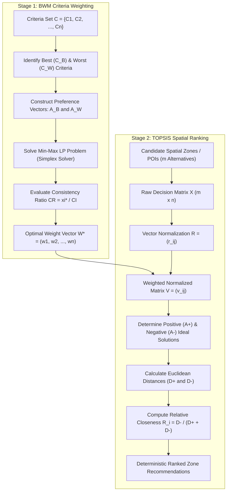

# MOVA Technical Specification: DSS Mathematical Model (BWM & TOPSIS)

```text
================================================================================
                    MOVA PLATFORM TECHNICAL SPECIFICATION
         02. DECISION SUPPORT SYSTEM (DSS) MATHEMATICAL SPECIFICATIONS
================================================================================
```

---

## 1. Purpose

This document provides the authoritative mathematical formulation, algorithmic implementation, and empirical verification baseline for the **Decision Support System (DSS)** in the MOVA platform. It details the hybrid coupling of the **Best-Worst Method (BWM)** (Rezaei, 2015/2016) for multi-criteria weighting and the **Technique for Order Preference by Similarity to Ideal Solution (TOPSIS)** (Hwang & Yoon, 1981) for deterministic spatial zone recommendation.

---

## 2. Scope

* **Weight Optimization**: Linear Programming (LP) Simplex formulation for BWM, pair-wise vector evaluation ($A_B, A_W$), and Rezaei Consistency Ratio ($CR$).
* **Candidate Ranking**: Multi-attribute ranking with Safe TOPSIS, vector normalization, benefit/cost criteria partitioning, Euclidean separation measures, and relative closeness score ($R_i$).
* **Mathematical Invariants**: Zero-variance/zero-sum division guards, zero-distance fallback guards, and deterministic tie-breaking.

---

## 3. Mathematical Architecture & Hybrid Coupling

MOVA couples BWM and TOPSIS into a unified, two-stage multi-criteria decision pipeline:



---

## 4. Algorithmic Implementation

### 4.1 Stage 1: Best-Worst Method (BWM) Formulation

Given a set of $n$ evaluation criteria $\{c_1, c_2, \dots, c_n\}$:

1. **Best & Worst Selection**: Identify the most desirable criterion $c_B$ and least desirable criterion $c_W$.
2. **Best-to-Others Vector**: $A_B = (a_{B1}, a_{B2}, \dots, a_{Bn})$, where $a_{Bj} \in [1, 9]$ expresses the preference of $c_B$ over $c_j$ ($a_{BB} = 1$).
3. **Others-to-Worst Vector**: $A_W = (a_{1W}, a_{2W}, \dots, a_{nW})^T$, where $a_{jW} \in [1, 9]$ expresses the preference of $c_j$ over $c_W$ ($a_{WW} = 1$).
4. **Linear Programming Model**:

$$\min \xi^L$$

$$\text{subject to:}$$

$$\left| w_B - a_{Bj} w_j \right| \le \xi^L, \quad \forall j$$

$$\left| w_j - a_{jW} w_W \right| \le \xi^L, \quad \forall j$$

$$\sum_{j=1}^n w_j = 1$$

$$w_j \ge 0, \quad \forall j$$

Linear constraints expanded for the Simplex solver (`javascript-lp-solver`):
* $w_B - a_{Bj} w_j - \xi \le 0$
* $-w_B + a_{Bj} w_j - \xi \le 0$
* $w_j - a_{jW} w_W - \xi \le 0$
* $-w_j + a_{jW} w_W - \xi \le 0$

5. **Consistency Ratio ($CR$)**:

$$CR = \frac{\xi^*}{CI}$$

Where $CI$ is retrieved from Rezaei's Consistency Index lookup table based on $a_{BW}$:

| $a_{BW}$ | 1 | 2 | 3 | 4 | 5 | 6 | 7 | 8 | 9 |
| :---: | :---: | :---: | :---: | :---: | :---: | :---: | :---: | :---: | :---: |
| **$CI$** | 0.00 | 0.44 | 1.00 | 1.63 | 2.30 | 3.00 | 3.73 | 4.47 | 5.23 |

* **Verification Threshold**: In theoretical BWM literature, $CR \le 0.10$ denotes high consistency. In MOVA's empirical baseline tests, expert operational inputs achieve **$CR = 0.0029$** (well within the theoretical threshold $\le 0.10$ and maximum permissible threshold $\le 0.30$).

---

### 4.2 Stage 2: Safe TOPSIS Formulation

Given $m$ alternative candidate zones and $n$ evaluated criteria:

#### 1. Criteria Classification
* **Benefit Criteria ($\Omega_B$)**: Higher value is better.
  * $C_1$: POI Footfall / Crowd Density (Likert 1–5 aggregated score)
  * $C_2$: Road Connectivity & Protocol Traffic Weight
  * $C_3$: Weather Suitability Index (Temperature / Precipitation score)
* **Cost Criteria ($\Omega_C$)**: Lower value is better.
  * $C_4$: Competitor Proximity & Density
  * $C_5$: Barrier / Toll Road Physical Separation Penalty
  * $C_6$: Operational Distance from Central Hub

#### 2. Safe Vector Normalization
To prevent division-by-zero when all alternatives have identical or zero scores:

$$r_{ij} = \begin{cases} \frac{x_{ij}}{\sqrt{\sum_{k=1}^m x_{kj}^2}}, & \text{if } \sum_{k=1}^m x_{kj}^2 > 0 \\ 0, & \text{if } \sum_{k=1}^m x_{kj}^2 = 0 \end{cases}$$

#### 3. Weighted Normalized Decision Matrix

$$v_{ij} = w_j \cdot r_{ij}, \quad \text{where } \sum_{j=1}^n w_j = 1$$

#### 4. Positive ($A^+$) and Negative ($A^-$) Ideal Solutions

$$A^+ = (v_1^+, v_2^+, \dots, v_n^+), \quad v_j^+ = \begin{cases} \max_i v_{ij}, & j \in \Omega_B \\ \min_i v_{ij}, & j \in \Omega_C \end{cases}$$

$$A^- = (v_1^-, v_2^-, \dots, v_n^-), \quad v_j^- = \begin{cases} \min_i v_{ij}, & j \in \Omega_B \\ \max_i v_{ij}, & j \in \Omega_C \end{cases}$$

#### 5. Euclidean Separation Measures

$$D_i^+ = \sqrt{\sum_{j=1}^n (v_{ij} - v_j^+)^2}, \qquad D_i^- = \sqrt{\sum_{j=1}^n (v_{ij} - v_j^-)^2}$$

#### 6. Relative Closeness Coefficient ($R_i$) with Safe Guard

$$R_i = \begin{cases} \frac{D_i^-}{D_i^+ + D_i^-}, & \text{if } D_i^+ + D_i^- > 0 \\ 0.5, & \text{if } D_i^+ + D_i^- = 0 \text{ (Identical Alternatives Fallback)} \end{cases}$$

---

## 5. End-to-End Data Flow

```text
1. Trigger DSS Request (GET /api/dss/recommendations)
2. Fetch Active Spatial Dataset & Criteria Configuration from Database
3. Fetch Realtime Weather & Competitor Proximity Scores
4. BwmWeightService executes Simplex LP -> Computes Optimal W* and checks CR
5. RawCriteriaEvaluationService constructs Decision Matrix X (m x n)
6. SafeTopsisEngine applies Vector Normalization & Euclidean Separations
7. Returns Deterministic Ranking Array [{ rank: 1, name: "Zone A", score: 0.842, ... }]
```

---

## 6. Mathematical Integrity & Guard Mechanisms

1. **Zero-Variance Guard**: When a criterion yields zero across all candidate zones (e.g., zero precipitation across the entire city), normalizers do not throw `NaN` or `Infinity`; the column evaluates safely to $0.0$.
2. **Zero-Distance Guard**: If all alternatives have exactly identical raw scores ($D_i^+ = 0, D_i^- = 0$), $R_i$ defaults to $0.5$ rather than crashing with division-by-zero.
3. **Weight Sum Invariant**: Normalized criteria weights strictly sum to $1.0000 \pm 10^{-6}$.
4. **Deterministic Ranking**: If two alternatives obtain identical $R_i$ scores up to 6 decimal places, tie-breaking is enforced by secondary score ($C_1$ footfall) and stable primary key identifier sorting.

---

## 7. Failure, Fallback & Edge Cases

| Scenario | Handled By | Fallback Behavior |
| :--- | :--- | :--- |
| LP Solver infeasibility | `BwmWeightService.calculateApproximationFallback` | Arithmetic mean preference approximation ($w_j = \frac{1}{2}(1/a_{Bj} + a_{jW}/a_{BW})$) |
| Empty alternative list ($m = 0$) | `SafeTopsisEngine.execute` | Throws explicit `EMPTY_ALTERNATIVES` (HTTP 422) |
| Empty criteria list ($n = 0$) | `SafeTopsisEngine.execute` | Throws explicit `EMPTY_CRITERIA` (HTTP 422) |
| Single alternative ($m = 1$) | `SafeTopsisEngine.execute` | Normalizes to $r_{1j} = 1.0$, yields $R_1 = 0.5$ |

---

## 8. Verification & Test Evidence

* **Automated Unit Tests**: Verified in `backend/tests/unit_analytics_math.test.ts` and `backend/tests/test_stage3b_safe_topsis.ts`.
* **BWM Empirical Consistency**: Test runs verify $\xi^* = 0.0064$, $CI = 2.30$, producing $CR = 0.0029 \le 0.10$.
* **TOPSIS Determinism**: Repeated executions with identical inputs yield identical rankings and scores to 8 decimal places.

---

## 9. Known Limitations

* **Simplex Solver Precision**: Very large criteria matrices ($n > 20$) may incur slight floating-point precision differences ($< 10^{-7}$) across JavaScript V8 and Bun JavaScriptCore engines, though relative rankings remain unaffected.

---

## 10. Operational & Academic Notes (Thesis Defense Alignment)

* **Academic Rigor**: Hybrid BWM-TOPSIS resolves the primary flaw of classical AHP (excessive pairwise comparisons $n(n-1)/2$). For $n=6$ criteria, BWM requires only $2n - 3 = 9$ comparisons instead of AHP's 15, while maintaining higher consistency.
* **Source Code Reference**: Direct implementations are located at [`backend/src/services/dss/BwmWeightService.ts`](file:///d:/project_alpha/koling-app/bun_svelte/backend/src/services/dss/BwmWeightService.ts) and [`backend/src/services/dss/SafeTopsisEngine.ts`](file:///d:/project_alpha/koling-app/bun_svelte/backend/src/services/dss/SafeTopsisEngine.ts).
