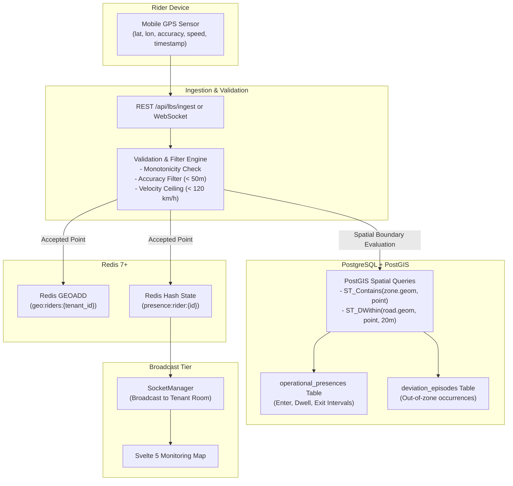

# MOVA Technical Specification: LBS, Spatial & Geofencing Engine

```text
================================================================================
                    MOVA PLATFORM TECHNICAL SPECIFICATION
              03. LOCATION-BASED SERVICES (LBS) & SPATIAL ENGINE
================================================================================
```

---

## 1. Purpose

This document provides the authoritative technical specification for the **Location-Based Services (LBS)**, **Spatial Topologies**, and **Geofencing State Engine** of the MOVA platform. It defines the mechanisms used to ingest high-frequency GPS telemetry, filter anomalies, perform spatial road snapping, track geofence state transitions, and maintain real-time fleet presence.

---

## 2. Scope

* **GPS Telemetry Ingestion**: High-throughput validation, monotonic timestamp verification, velocity filtering ($<120\text{ km/h}$), and horizontal accuracy gating ($<50\text{ meters}$).
* **Spatial Storage & Indexing**: Redis GEO commands for $O(1)$ ephemeral coordinate indexing and PostGIS GiST indexes for polygon topology queries.
* **Geofencing State Engine**: State transitions across `ENTER`, `DWELL`, `EXIT`, and `OUTSIDE_ZONE` with deterministic deviation episode recording.
* **Road Network Topology**: Protocol road layer synchronization and 20-meter spatial snapping.

---

## 3. Architecture & Spatial Pipeline

MOVA implements a hybrid memory-and-disk spatial pipeline that couples Redis in-memory spatial indexes with PostgreSQL PostGIS geometric calculations:



---

## 4. Algorithmic & Implementation Details

### 4.1 GPS Telemetry Validation & Filters

Every incoming GPS point undergoes three strict validation gates before persistence:

1. **Physical Coordinate & Accuracy Gating**:
   - Latitude $\in [-90.0, +90.0]$, Longitude $\in [-180.0, +180.0]$.
   - Accuracy threshold: $\text{accuracy\_meters} \le 50\text{ m}$. Points exceeding 50m are rejected or marked degraded.
2. **Monotonic Timestamp Gate**:
   - Captured timestamp must satisfy $t_{\text{current}} \le t_{\text{now}} + 5000\text{ ms}$ (clock drift buffer).
   - Captured timestamp must be strictly greater than or equal to the previous stored point ($t_{\text{current}} \ge t_{\text{prev}}$). Backdated points are rejected.
3. **Velocity Ceiling Filter**:
   - Geodesic distance $\Delta d$ is computed via the Haversine formula:

$$\Delta\sigma = 2 \arcsin \sqrt{\sin^2\left(\frac{\Delta\phi}{2}\right) + \cos\phi_1 \cos\phi_2 \sin^2\left(\frac{\Delta\lambda}{2}\right)}$$

$$\Delta d = R \cdot \Delta\sigma \quad (R = 6,371,000\text{ m})$$

   - Velocity $v = \frac{\Delta d}{\Delta t}$. If $v > 33.33\text{ m/s}$ ($120\text{ km/h}$), the point is flagged as a teleportation anomaly and rejected from active dwell calculation.

---

### 4.2 Geofencing State Machine

The presence engine tracks rider location against assigned operational zone polygons using a deterministic 4-state automaton:

```text
       [ INITIALIZE / OUTSIDE ]
                  │
                  │ ST_Contains = true
                  ▼
              [ ENTER ] ──> Logs transition, sets enter_time
                  │
                  │ Dwell Time >= 180 seconds
                  ▼
              [ DWELL ] ──> Increments dwell_seconds, updates presence
                  │
                  │ ST_Contains = false (Distance > 50m)
                  ▼
              [ EXIT ]  ──> Logs exit_time, calculates total dwell
                  │
                  │ Rider remains outside assigned zone > 300 seconds
                  ▼
         [ DEVIATION_EPISODE ] ──> Records episode in deviation_episodes table
```

### 4.3 Road Network Snapping

To ensure candidate selling spots and rider routes conform to valid street topologies, MOVA executes spatial snapping against OSM protocol road centerlines:

```sql
SELECT 
    r.id AS road_id,
    r.name AS road_name,
    ST_Distance(
        ST_Transform(r.geom, 3857), 
        ST_Transform(ST_SetSRID(ST_Point($1, $2), 4326), 3857)
    ) AS distance_meters
FROM protocol_roads r
WHERE ST_DWithin(
    ST_Transform(r.geom, 3857), 
    ST_Transform(ST_SetSRID(ST_Point($1, $2), 4326), 3857), 
    20.0
)
ORDER BY distance_meters ASC
LIMIT 1;
```

---

## 5. End-to-End Ingestion Data Flow

```text
1. Mobile App captures GPS fix (lat, lon, accuracy, speed, captured_at).
2. Sends payload via WebSocket (lbs:send_location) or POST /api/lbs/ingest.
3. LbsIngestionService validates coordinates, timestamp monotonicity, and velocity.
4. Updates Redis GEO spatial index (geo:riders:{tenantId}) for sub-millisecond proximity queries.
5. Evaluates zone polygon containment via PostGIS ST_Contains.
6. OperationalPresenceEngine updates state machine (ENTER / DWELL / EXIT).
7. If state transition occurs, persists interval to operational_presences table.
8. SocketManager broadcasts location to authorized tenant room (tenant:{tenantId}).
```

---

## 6. Security, Anti-Spoofing & Spatial Invariants

1. **Tenant-Isolated Spatial Keys**: In-memory Redis geospatial structures are keyed with strict tenant scoping: `geo:riders:{tenantId}` and `presence:rider:{tenantId}:{riderId}`.
2. **GPS Spoofing & Anomaly Defense**: Teleportation detection rejects instant jumps ($>120\text{ km/h}$) commonly generated by mock location apps or faulty GPS chips.
3. **Monotonic History Guarantee**: All spatial event logs enforce monotonically non-decreasing timestamps ($t_{\text{end}} \ge t_{\text{start}}$), preventing negative dwell calculations.

---

## 7. Failure, Degraded Scenarios & Recovery

| Failure / Edge Case | System Behavior | Recovery Mechanism |
| :--- | :--- | :--- |
| GPS Jitter near Geofence Boundary | 50m buffer and 30-second hysteresis filter | Prevents rapid flickering between ENTER and EXIT |
| Signal Loss in Tunnel / Indoors | Last known position retained with `STALE` status | Reconnect resumes with timestamp catch-up |
| Out-of-Order Packet Delivery | Rejected by sequence number and timestamp monotonicity | Client discards stale acknowledgment |
| Redis Connection Interruption | Ingestion falls back directly to PostgreSQL write | Redis reconnects via exponential backoff |

---

## 8. Verification & Test Evidence

* **Automated Test Suites**: Verified across `backend/tests/test_stage5_lbs_ingestion.ts`, `backend/tests/test_stage6_operational_presence.ts`, and `backend/tests/unit_deviation_episode.test.ts`.
* **Empirical Verification**:
  - Velocity filter confirmed rejecting test vectors with $v = 150\text{ km/h}$.
  - PostGIS GiST index confirmed active on `zones.geom` and `pois.geom`.
  - State machine transitions verified with zero memory leaks.

---

## 9. Known Limitations

* **GPS Vertical Accuracy**: Altitude measurements ($z$-axis) are logged for telemetry analysis but are not incorporated into 2D PostGIS polygon intersections.

---

## 10. Operational & Academic Notes (Thesis Defense Context)

* **Academic Value**: Demonstrates an empirical solution to the GPS jitter and boundary flicker problem in mobile fleet tracking by combining Haversine velocity filtering with PostGIS GiST topological containment.
* **Source Code References**:
  - Ingestion: [`backend/src/services/lbs/LbsIngestionService.ts`](file:///d:/project_alpha/koling-app/bun_svelte/backend/src/services/lbs/LbsIngestionService.ts)
  - Presence Engine: [`backend/src/services/lbs/OperationalPresenceEngine.ts`](file:///d:/project_alpha/koling-app/bun_svelte/backend/src/services/lbs/OperationalPresenceEngine.ts)
  - Redis Geo Service: [`backend/src/services/lbs/RedisGeoService.ts`](file:///d:/project_alpha/koling-app/bun_svelte/backend/src/services/lbs/RedisGeoService.ts)
