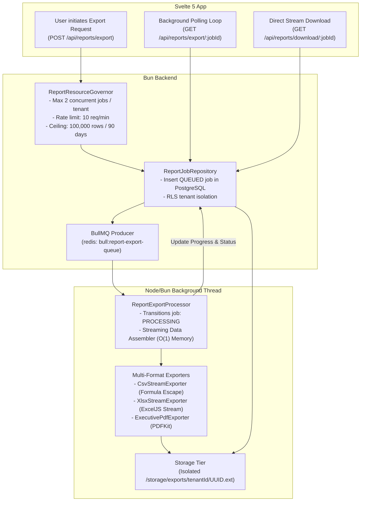

# MOVA Technical Specification: Historical Analytics & Reporting Engine

```text
================================================================================
                    MOVA PLATFORM TECHNICAL SPECIFICATION
           04. HISTORICAL ANALYTICS & OPERATIONAL REPORTING ENGINE
================================================================================
```

---

## 1. Purpose

This document provides the authoritative technical specification for the **Historical Analytics Engine (Milestone S7-03)** and the **Operational Reporting & Streaming Document Generator (Milestone S7-05)** of the MOVA platform. It defines the temporal interval standards, period-over-period comparative mathematics, asynchronous BullMQ queue architecture, multi-format streaming generation (CSV, XLSX, PDF), and resource governance policies.

---

## 2. Scope

* **Historical Analytics (S7-03)**: Half-open temporal intervals `[start, end)`, standardized presets (`today`, `yesterday`, `last7days`, `last30days`, `thisMonth`, `custom`), symmetric prior-period math, and the *Zero-Fake-Data* invariant.
* **Operational Reporting (S7-05)**: Multi-format streaming document exporters (CSV, Excel XLSX, Executive PDF), BullMQ asynchronous worker pipeline, Resource Governor concurrency limits, and artifact security.
* **Report Capabilities**: `PRESENCE_REPORT`, `ZONE_PERFORMANCE_REPORT`, `RIDER_PERFORMANCE_REPORT`, and the formally deferred `SALES_SETTLEMENT_REPORT`.

---

## 3. Architecture & Asynchronous Reporting Pipeline

MOVA separates analytical queries and document generation from the synchronous HTTP request thread using a resilient, bounded asynchronous worker pipeline:



---

## 4. Implementation Details

### 4.1 Temporal Invariants & Period Comparison (S7-03)

1. **Half-Open Interval Invariant**: All temporal queries strictly enforce half-open ranges `[start, end)`, where $t_{\text{start}} \le t < t_{\text{end}}$. This eliminates double-counting of boundary records across consecutive periods.
2. **Symmetric Prior Period Invariant**: For any given range of duration $\Delta t = t_{\text{end}} - t_{\text{start}}$, the comparison baseline is computed symmetrically:

$$t_{\text{prev\_end}} = t_{\text{start}}, \qquad t_{\text{prev\_start}} = t_{\text{start}} - \Delta t$$

3. **Zero-Fake-Data Invariant**:
   - If a tenant has zero recorded operational events in a period, the system returns `null` for ratio-based KPIs (e.g., `complianceRate = null`), explicitly avoiding synthetic zeros (`0.0%`).
   - Period-over-period percentage delta is defined as:

$$\Delta\% = \begin{cases} \frac{v_{\text{curr}} - v_{\text{prev}}}{v_{\text{prev}}} \times 100, & \text{if } v_{\text{prev}} > 0 \\ \text{null (UP\_FROM\_ZERO)}, & \text{if } v_{\text{prev}} = 0 \text{ and } v_{\text{curr}} > 0 \\ 0.0 \text{ (UNCHANGED)}, & \text{if } v_{\text{prev}} = 0 \text{ and } v_{\text{curr}} = 0 \\ \text{null (UNAVAILABLE)}, & \text{if } v_{\text{curr}} = \text{null} \text{ or } v_{\text{prev}} = \text{null} \end{cases}$$

---

### 4.2 Multi-Format Streaming Exporters (S7-05)

1. **CSV Streaming Exporter**:
   - Generates RFC 4180 compliant CSV using chunked pipeline streaming to maintain $O(1)$ heap memory.
   - **Formula Injection Defense**: Escapes dangerous prefix characters (`=`, `+`, `-`, `@`) with a leading single quote (`'`) to protect operators viewing files in Microsoft Excel or Google Sheets.
2. **XLSX Streaming Exporter**:
   - Utilizes `exceljs.stream.xlsx.WorkbookWriter` to flush rows directly to disk without holding complete workbook objects in RAM.
   - Applies automated column auto-width calculation and tenant branding headers.
3. **Executive PDF Exporter**:
   - Uses `pdfkit` to compile high-density executive summaries, KPI tables, and compliance distribution charts.

---

### 4.3 Resource Governance & Operational Ceilings

The `ReportResourceGovernor` enforces strict operational bounds before enqueuing generation tasks:

| Policy / Constraint | Value | Enforcement Action |
| :--- | :--- | :--- |
| **Max Concurrent Jobs per Tenant** | 2 active jobs | Rejects with HTTP `429 TOO_MANY_REQUESTS` |
| **Max Export Rows** | 100,000 rows | Truncates with `truncated: true` flag in metadata |
| **Max Query Range Window** | 90 days | Rejects with HTTP `422 UNPROCESSABLE_ENTITY` |
| **Job Rate Limit** | 10 requests / minute | Throttled via Redis distributed rate limiter |
| **Artifact TTL Retention** | 24 hours | Automatic file deletion via background cleanup cron |

---

## 5. End-to-End Report Generation Flow

```text
1. Client submits POST /api/reports/export with parameters:
   { "report_type": "PRESENCE_REPORT", "format": "XLSX", "range_start": "...", "range_end": "..." }

2. Controller invokes ReportResourceGovernor:
   - Validates time window (<= 90 days).
   - Checks active tenant concurrency in PostgreSQL (< 2 jobs in QUEUED/PROCESSING).

3. Job record created in PostgreSQL report_export_jobs table with status 'QUEUED'.
4. Job ID pushed to Redis BullMQ queue (report-export-queue).
5. Background worker picks up job:
   - Updates status to 'PROCESSING'.
   - Streams database cursor query using tenant-isolated RLS connection.
   - Writes directly to disk artifact in /storage/exports/{tenantId}/{jobId}.xlsx.
   - Periodically updates progress (10% -> 50% -> 100%).

6. Worker marks job 'COMPLETED' with row_count and artifact_path.
7. Client polling detects 'COMPLETED' and triggers GET /api/reports/download/:jobId.
8. Download controller verifies tenant ownership and streams file attachment.
```

---

## 6. Security, Formula Injection & Artifact Isolation

1. **CSV / Spreadsheet Formula Injection Sanitization**: Any string cell beginning with active formula triggers (`=`, `+`, `-`, `@`) is sanitized:

```typescript
export function sanitizeCellForCsv(value: string | number | null | undefined): string {
  if (value === null || value === undefined) return "";
  const str = String(value);
  if (/^[=+\-@\t\r]/.test(str)) {
    return `'${str}`; // Prepend single quote escape
  }
  return str;
}
```

2. **Directory Traversal Defense**: Download requests validate that resolved file paths reside strictly within the authorized tenant export root directory (`/storage/exports/{tenantId}/`), preventing `..` traversal attacks.
3. **Artifact Isolation**: Download endpoints query `report_export_jobs` under active RLS context, returning `404 Not Found` if a user probes an export ID created by another tenant.

---

## 7. Failure Scenarios & Edge Cases

| Failure Scenario | Engine Behavior | User-Visible Output |
| :--- | :--- | :--- |
| Worker Crash / Out of Memory | BullMQ retry backoff (3 attempts), then marks `FAILED` | UI displays "Generation Failed: Worker Error" |
| Query Range Exceeds 90 Days | Governor rejects before database hit | HTTP 422: `EXPORT_RANGE_EXCEEDS_LIMIT` |
| Dataset Exceeds 100k Rows | Exporter cuts stream at 100,000 and marks truncated | Header alert: "Report truncated at 100,000 rows" |
| Database Connection Drops | Error captured, temporary partial file deleted from disk | Job transitions to `FAILED` with clean disk state |

---

## 8. Verification & Test Evidence

* **Automated Unit & Contract Test Suites**: Verified across all 17 backend unit test files and 2 frontend store test files:
  - `unit_analytics_math.test.ts` (12 tests)
  - `unit_analytics_time.test.ts` (24 tests)
  - `unit_period_comparison.test.ts` (31 tests)
  - `unit_presence_aggregation.test.ts` (5 tests)
  - `unit_report_worker_governor.test.ts` (6 tests)
  - `unit_report_data_assembler.test.ts` (11 tests)
  - `unit_report_job_repository.test.ts` (8 tests)
  - `unit_streaming_csv_exporter.test.ts` (20 tests)
  - `unit_streaming_xlsx_exporter.test.ts` (15 tests)
  - `unit_executive_pdf_exporter.test.ts` (23 tests)
  - `unit_reporting_state_machine.test.ts` (28 tests)
  - `unit_reporting_openapi_contract.test.ts` (20 tests)
  - `unit_reporting_full_abuse_regression.test.ts` (30 tests)
* **Total Assertions**: **883 assertions passed** with zero failures.

---

## 9. Known Limitations & Deferred Capabilities

* **Deferred Feature**: **`SALES_SETTLEMENT_REPORT`**
  - **Status**: Formally **`DEFERRED`** across backend services, OpenAPI schemas, and frontend UI.
  - **Root Cause**: The underlying database table `shift_settlements` currently lacks an explicit `tenant_id` foreign key. To maintain uncompromising multi-tenant RLS guarantees, this report is excluded from RC-1.
* **Continuous Fleet Utilization**: Operational presence tracks discreet dwell intervals; continuous 24/7 engine telemetry is not persisted.

---

## 10. Operational & Academic Notes (Thesis Context)

* **Academic Contribution**: Demonstrates that high-volume enterprise reporting can be integrated into a mobile analytics platform without introducing heavy microservices or memory bloat by leveraging Node/Bun streaming transformers and BullMQ task offloading.
* **Source Code References**:
  - Exporters: [`backend/src/services/reporting/`](file:///d:/project_alpha/koling-app/bun_svelte/backend/src/services/reporting/)
  - Analytics Services: [`backend/src/services/analytics/`](file:///d:/project_alpha/koling-app/bun_svelte/backend/src/services/analytics/)
  - Frontend Store: [`frontend/src/lib/stores/reportExportStore.svelte.ts`](file:///d:/project_alpha/koling-app/bun_svelte/frontend/src/lib/stores/reportExportStore.svelte.ts)
