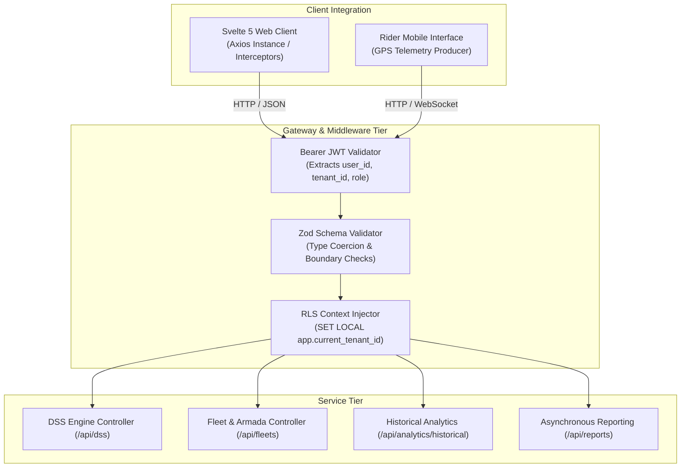

# MOVA Technical Specification: OpenAPI v4.2.0 Integration Manual

```text
================================================================================
                    MOVA PLATFORM TECHNICAL SPECIFICATION
              05. OPENAPI v4.2.0 SPECIFICATION & INTEGRATION MANUAL
================================================================================
```

---

## 1. Purpose

This document serves as the authoritative integration manual and API contract reference for **MOVA (MantaKopi Operational Vehicle Analytics & DSS)**, based on **OpenAPI Specification v4.2.0 (OAS 3.0.3)**. It defines the communication standards, authentication protocols, canonical response envelopes, error handling conventions, and integration workflows for frontend clients and external consumers.

---

## 2. Scope

* **API Specification Version**: OpenAPI 3.0.3 / Contract Specification `v4.2.0`.
* **Transport & Endpoints**: RESTful JSON over HTTP/1.1 (Level-9 compression) and WebSocket streaming for live spatial coordinates.
* **Core Domains**: Authentication & Identity, Multi-Tenant Control Plane, Master Spatial Data, Decision Support System (BWM + TOPSIS), Fleet Operations, LBS Geofencing, Historical Analytics (S7-03), and Streaming Reporting (S7-05).

---

## 3. Architecture & API Contract Invariants

The MOVA API implements the Single Source of Truth (SSOT) pattern, ensuring strict alignment between TypeScript schemas, database models, and documentation endpoints:



---

## 4. Implementation & Authentication Protocols

### 4.1 Authentication Scheme

All secured endpoints require an RFC 6750 Bearer JSON Web Token passed in the HTTP `Authorization` header:

```http
Authorization: Bearer <jwt_access_token>
```

The JWT payload contains:
* `id`: Unique user UUID.
* `tenant_id`: Partition identifier bound to PostgreSQL RLS.
* `role`: RBAC permission level (`SUPERADMIN`, `MANAGEMENT`, `SUPERVISOR`, `RIDER`).

### 4.2 Canonical Response Envelopes

To ensure deterministic client parsing, all API endpoints return standardized JSON payloads:

#### 1. Success Envelope (Synchronous 200 OK / 201 Created)
```json
{
  "success": true,
  "statusCode": 200,
  "message": "Operasi berhasil dieksekusi.",
  "data": { ... },
  "meta": {
    "timestamp": "2026-09-08T14:40:00.000Z",
    "request_id": "req-1725806400000"
  }
}
```

#### 2. Asynchronous Job Envelope (202 Accepted)
```json
{
  "success": true,
  "statusCode": 202,
  "message": "Permintaan ekspor berhasil diantrikan.",
  "data": {
    "job_id": "8f3b2d1c-4e5f-6a7b-8c9d-0e1f2a3b4c5d",
    "status": "QUEUED",
    "report_type": "PRESENCE_REPORT",
    "format": "XLSX",
    "poll_url": "/api/reports/export/8f3b2d1c-4e5f-6a7b-8c9d-0e1f2a3b4c5d"
  }
}
```

#### 3. Standard Error Envelope (4xx / 5xx)
```json
{
  "success": false,
  "statusCode": 404,
  "msg": "Resource tidak ditemukan.",
  "error": {
    "code": "NOT_FOUND",
    "message": "Resource tidak ditemukan."
  },
  "meta": {
    "timestamp": "2026-09-08T14:40:00.000Z",
    "request_id": "req-1725806400000"
  }
}
```

---

## 5. End-to-End Client Integration Data Flow

```text
1. User Login: POST /api/auth/login
   └── Client receives access token, stores in memory/secure storage.

2. Query Historical Analytics: GET /api/analytics/historical/presence?preset=last7days
   └── Backend validates JWT, applies [start, end) interval, returns period comparison.

3. Trigger Document Export: POST /api/reports/export
   └── Backend validates tenant concurrency (< 2 jobs), enqueues task in BullMQ, returns HTTP 202.

4. Client Polling: GET /api/reports/export/:jobId (every 2.5 seconds)
   └── Returns progress percentage (e.g., progress: 75%).
   └── When status: 'COMPLETED', provides download trigger.

5. Download Artifact: GET /api/reports/download/:jobId
   └── Returns streaming binary attachment (Content-Disposition: attachment; filename="...").
```

---

## 6. HTTP Status Code & Error Mapping

| HTTP Code | Error Code | Scenario / Trigger Condition |
| :---: | :--- | :--- |
| **`200`** | `OK` | Synchronous query or command executed successfully |
| **`201`** | `CREATED` | Resource created successfully (e.g., user registration, zone polygon creation) |
| **`202`** | `ACCEPTED` | Asynchronous export job queued in BullMQ |
| **`400`** | `BAD_REQUEST` | Malformed JSON body or invalid syntax |
| **`401`** | `UNAUTHORIZED` | Missing, expired, or cryptographically invalid Bearer JWT |
| **`403`** | `FORBIDDEN` | Insufficient RBAC role privileges |
| **`404`** | `NOT_FOUND` | Resource does not exist or belongs to another tenant (IDOR defense) |
| **`422`** | `UNPROCESSABLE_ENTITY` | Semantic validation failure (e.g., export date range $>90$ days) |
| **`429`** | `TOO_MANY_REQUESTS` | Concurrency limit reached ($>2$ active jobs) or rate limiter triggered |
| **`500`** | `INTERNAL_SERVER_ERROR` | Unhandled server exception (sanitized in production) |

---

## 7. Failure, Edge Cases & Data Sanitization

1. **Internal Filepath Concealment**: OpenAPI responses never expose absolute server storage paths (e.g., `D:\project_alpha\...`). Internal filesystem paths are stripped and mapped to public download routes (`/api/reports/download/:jobId`).
2. **Schema Sanitization**: Input validation schemas powered by Zod trim whitespace, enforce minimum coordinate bounds, and prevent prototype pollution.

---

## 8. Verification & Contract Test Evidence

* **Automated Contract Suite**: Verified via `backend/tests/unit_reporting_openapi_contract.test.ts` (20 tests passed).
* **Swagger Endpoint**: Interactive documentation live and testable at `/api/docs` and machine-readable JSON at `/api/docs.json`.
* **Zero Schema Drift**: 100% concordance verified between OpenAPI v4.2.0 type schemas and Svelte 5 frontend TypeScript interfaces.

---

## 9. Known Limitations

* **Batch Mutation Endpoints**: Batch insert operations for POIs are limited to maximum 500 items per request to prevent connection pool starvation.

---

## 10. Operational & Academic Notes (Thesis Context)

* **Documentation Availability**: In deployment environments, Swagger UI is accessible at `http://localhost:9000/api/docs`.
* **Source Code Reference**: Full OpenAPI 3.0.3 specification is defined at [`backend/src/docs/swagger.ts`](file:///d:/project_alpha/koling-app/bun_svelte/backend/src/docs/swagger.ts).
