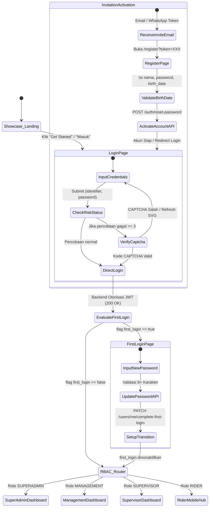
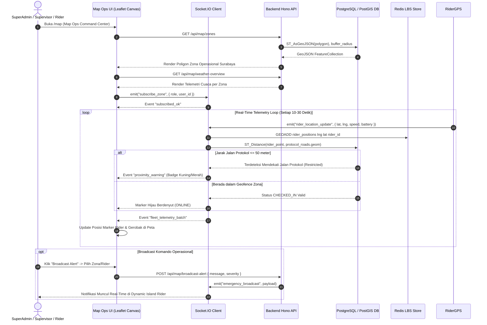
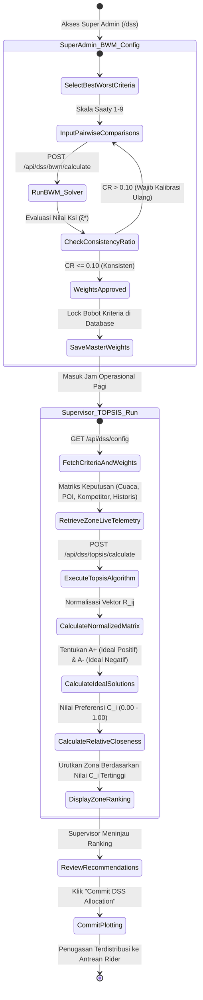
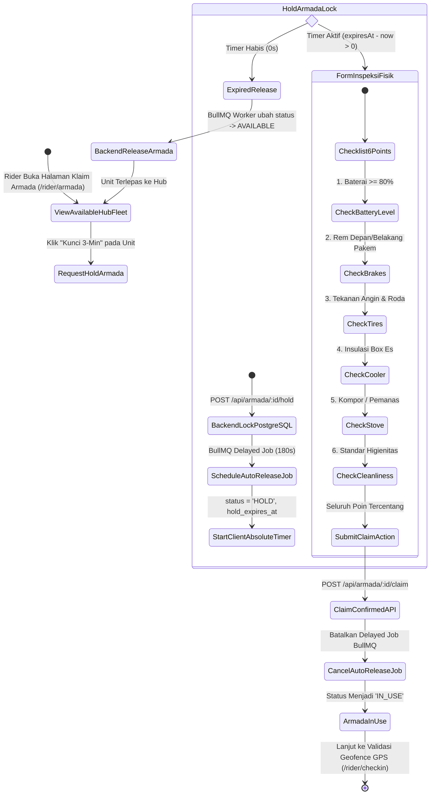
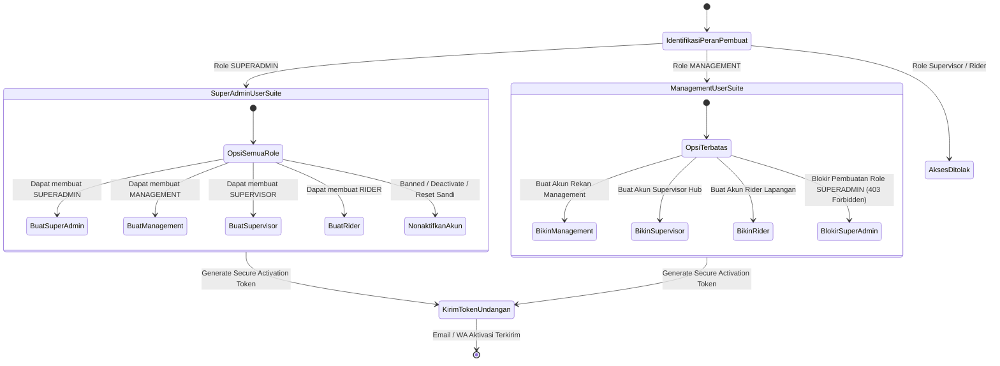

# Diagram Aktivitas Sistem MOVA (Activity & Workflow Diagrams)

Dokumen ini memetakan seluruh alur aktivitas (*activity diagrams*) untuk sistem **MOVA**, menghubungkan interaksi antara pengguna, antarmuka frontend Svelte 5, backend Bun Hono, dan basis data PostgreSQL/PostGIS.

---

## 1. Alur Aktivitas: Autentikasi & Manajemen Sesi (Auth Lifecycle)

Diagram aktivitas ini menggambarkan siklus masuk sistem, eskalasi CAPTCHA saat brute-force terdeteksi, penegakan ganti password pada login perdana (*first login*), hingga aktivasi akun berbasis token undangan.

---

## 2. Alur Aktivitas: Map Ops & Komando Spasial GIS (Spatial Monitoring)

Diagram aktivitas ini menggambarkan cara kerja halaman **Map Ops** yang terintegrasi dengan WebSocket LBS, PostGIS Geofence, dan deteksi jarak batas jalan protokol ($\pm 50\text{m}$).

---

## 3. Alur Aktivitas: Manajemen DSS (BWM & TOPSIS Optimization)

Memisahkan kewenangan Super Admin (konfigurasi master bobot BWM) dengan Supervisor (eksekusi perhitungan TOPSIS dan alokasi rekomendasi zona harian).

---

## 4. Alur Aktivitas: Manajemen Armada & Kunci Sementara 180s (Fleet Claim)

Menjamin integritas fisik gerobak melalui penguncian anti-balap (*concurrency lock*) 180 detik berbasis *absolute timestamp* dan inspeksi 6-poin sebelum penggunaan.

---

## 5. Alur Aktivitas: Siklus Harian Rider Lapangan (Rider Mobile PWA)

Langkah terstruktur 1 sampai 5 yang dikemas dalam *Full-Screen Step Pages* untuk kenyamanan di lapangan tanpa modal pop-up yang mudah tertutup.

```mermaid
stateDiagram-v2
    [*] --> Langkah1_Presensi : Buka /rider/duty (Apel Pagi)
    
    state Langkah1_Presensi {
        [*] --> TekanPresensiHadir : Klik "Konfirmasi Hadir Siap Bertugas"
        TekanPresensiHadir --> MasukAntreanFIFO : Status 'QUEUED'
        MasukAntreanFIFO --> MenungguKomandoSupervisor : Supervisor Commit DSS TOPSIS
        MenungguKomandoSupervisor --> NotifikasiPlottingZona : Status 'ASSIGNED' (Zona Ditugaskan)
    }

    Langkah1_Presensi --> Langkah2_KlaimArmada : Buka /rider/armada
    
    state Langkah2_KlaimArmada {
        [*] --> PilihGerobakHub : Kunci Unit 180s
        PilihGerobakHub --> InspeksiFisik6Poin : Baterai, Rem, Higienitas
        InspeksiFisik6Poin --> KlaimResmiInUse : Status 'IN_USE'
    }

    Langkah2_KlaimArmada --> Langkah3_GeofenceCheckIn : Perjalanan ke Zona Penugasan (/rider/checkin)

    state Langkah3_GeofenceCheckIn {
        [*] --> BacaKoordinatGPS : navigator.geolocation (High Accuracy)
        BacaKoordinatGPS --> EvaluasiPoligonPostGIS : ST_DWithin(gps_point, zone_geom, 50m)
        
        state GeofenceCheck <<choice>>
        GeofenceCheck --> DiDalamZona : Jarak <= Buffer 50m
        GeofenceCheck --> DiLuarZona : Jarak > 50m

        DiLuarZona --> TampilkanDistanceGauge : "Kurang ±X meter lagi ke batas zona"
        TampilkanDistanceGauge --> BacaKoordinatGPS : Bergerak Mendekat

        DiDalamZona --> CheckInApproved : Status 'CHECKED_IN' (Tercatat di Sistem)
    }

    Langkah3_GeofenceCheckIn --> Langkah4_KasirPOS : Gerobak Mulai Buka (/rider/pos)

    state Langkah4_KasirPOS {
        [*] --> PilihMenuKopi : Tambah Item ke Keranjang
        PilihMenuKopi --> GenerateIdempotencyKey : UUIDv4 Idempotency Key
        GenerateIdempotencyKey --> PilihMetodeBayar

        state BayarChoice <<choice>>
        BayarChoice --> BayarTunai : Metode CASH
        BayarChoice --> BayarQRIS : Metode QRIS

        BayarTunai --> HitungUangKembalian : Input Uang Fisik Diterima
        BayarQRIS --> TampilkanDynamicQRIS : Countdown 180 Detik

        HitungUangKembalian --> SimpanTransaksiAPI : POST /api/rider/sales
        TampilkanDynamicQRIS --> SimpanTransaksiAPI : Pembayaran Terkonfirmasi
        SimpanTransaksiAPI --> UpdateKasHarian : Akumulasi Pendapatan Shift
    }

    Langkah4_KasirPOS --> Langkah5_SettlementSore : Jam Shift Berakhir (/rider/settlement)

    state Langkah5_SettlementSore {
        [*] --> InputSisaBaterai : Penggeser Slider Baterai (%)
        InputSisaBaterai --> EvaluasiAmbangBaterai
        
        state BateraiThreshold <<choice>>
        BateraiThreshold --> StatusCharging : Baterai < 30% (Wajib Cas di Hub)
        BateraiThreshold --> StatusActive : Baterai >= 30% (Unit Siap Shift Berikutnya)

        StatusCharging --> RekonsiliasiKas : Hitung Sisa Cup Fisik
        StatusActive --> RekonsiliasiKas : Hitung Sisa Cup Fisik

        RekonsiliasiKas --> EvaluasiSelisihKas
        state SelisihKas <<choice>>
        SelisihKas --> KasPas : Selisih == Rp 0
        SelisihKas --> AdaSelisih : Selisih != Rp 0 (Wajib Isi Alasan)

        AdaSelisih --> KirimSettlementAPI : POST /api/rider/session/checkout
        KasPas --> KirimSettlementAPI : POST /api/rider/session/checkout

        KirimSettlementAPI --> SelesaiShift : LBS Radar Dibersihkan & Logout
    }

    Langkah5_SettlementSore --> [*] : Shift Selesai
```

---

## 6. Alur Aktivitas: Manajemen User Hierarkis (SuperAdmin vs Management)

Mematuhi batasan bahwa **Management berhak membuat akun secara berjenjang, namun dilarang keras membuat akun Super Admin**.

