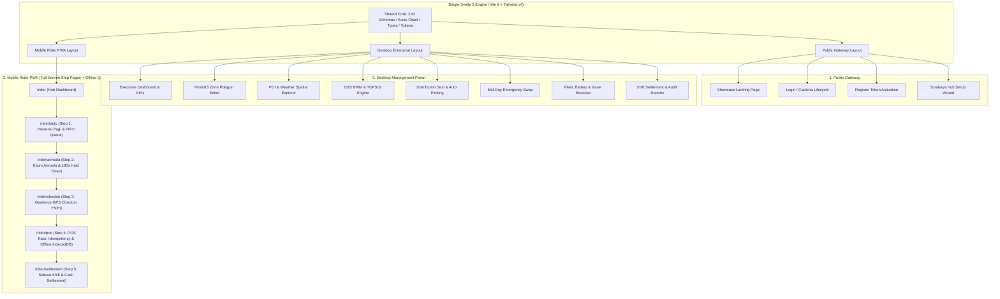
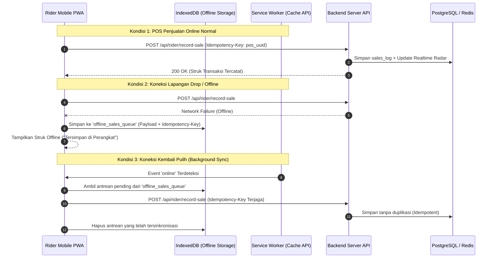

# 🗺️ FRONTEND MASTER IMPLEMENTATION PLAN (MOVA — Move Where Demand Is. / COZIS DSS)
**Version:** 3.1 — Production Grade & PWA Offline-First Architecture  
**Platform Identity:** **MOVA** (*Move Where Demand Is.* — Decision Support System & Dynamic Fleet Optimization Platform)  
**Single Framework Engine:** Svelte 5 (Runes) + Vite 8 + Tailwind CSS v4 + PostGIS Spatials + Dual-Channel LBS (Socket.IO/HTTP) + PWA Offline Queue (IndexedDB)  
**Dokumen Referensi:** [E2E_WORKFLOW_MAP.md](file:///f:/project_zero/E2E_WORKFLOW_MAP.md) & [walkthrough.md](file:///C:/Users/Febriyan/.gemini/antigravity-ide/brain/9230dfa6-3c3a-40fd-b174-bca4fab0a213/walkthrough.md)

---

## 📌 1. Executive Summary & Keputusan Arsitektur Tunggal (Mono-Framework)

Berdasarkan analisis kelayakan teknis dan evaluasi *trade-off*, platform **MOVA** menetapkan arsitektur **Single Framework (Svelte 5) untuk seluruh antarmuka (Desktop Admin, Area Supervisor, dan Mobile Rider PWA)**.

### 🚫 Mengapa Menolak Pemisahan ke React untuk Rider PWA?
1. **Eliminasi Technical Debt & Code Duplication**: Token desain *Obsidian Kinetic Dark*, skema validasi Zod, tipe DTO TypeScript, dan kontrak API Axios dapat digunakan bersama ($100\%$ *shared codebase*) tanpa perlu menulis ulang komponen ganda di React dan Svelte.
2. **Performa Unggul di Smartphone Low-End Lapangan**: Svelte 5 mengompilasi kode menjadi JavaScript murni yang sangat kecil (*zero Virtual DOM overhead*), menghasilkan ukuran bundel di bawah 80 kB (gzipped) sehingga *First Contentful Paint (FCP)* sangat instan pada koneksi seluler 3G/4G di lapangan Surabaya & Sidoarjo.
3. **PWA Standar Web APIs**: PWA tidak bergantung pada React. PWA bergantung pada standar Web APIs (`ServiceWorker`, `CacheStorage`, `IndexedDB`, dan `Web App Manifest`) yang berjalan luar biasa cepat di lingkungan Svelte 5 / Vite.



---

## 🎨 2. Design System & Visual Language (Obsidian Kinetic Dark)

- **Background Canvas**: Deep Obsidian `#09090B`, Elevated Card `#131317`, Card Border `#24242A` / `#2B2B38`.
- **Aksen Utama**: Vibrant Coral `#FF634A` (Hover `#FF4D30`, Light `#FF8573`).
- **Palet Status & Fungsional**:
  - **Emerald Green** `#10B981`: Status Aktif, Check-in Tervalidasi, Baterai Prima ($\ge 80\%$), Klaim Resmi (`IN_USE`).
  - **Sky Blue** `#38BDF8`: LBS Radar Telemetri, Cuaca Cerah, Dynamic QRIS.
  - **Amber Orange** `#F59E0B`: Antrean FIFO (`WAITING`), 180s Hold Lock Timer, Baterai Charging Threshold ($< 30\%$).
  - **Royal Purple** `#A855F7`: Bobot Kriteria BWM, Commit Distribusi, Shift Settlement.
  - **Rose Red** `#F43F5E`: Peringatan Poligon Overlap, Jalan Protokol Terlarang, Selisih Kas Negatif.
- **Tipografi**:
  - Heading: `Outfit` (Modern geometric, bold).
  - Body / UI: `Inter` / System Sans.
  - Data / Telemetri / Monospace: `JetBrains Mono` (Koordinat GPS, Nilai Rupiah, Token, Timer).

---

## 📱 3. Arsitektur PWA (Progressive Web App) & Offline Resilience untuk Rider

Untuk memastikan kelancaran operasional di lapangan tanpa ketergantungan koneksi internet yang stabil:



### Spesifikasi Infrastruktur PWA & Offline Resilience:
1. **Web App Manifest (`manifest.webmanifest`)**:
   - `name`: "MOVA — Move Where Demand Is."
   - `short_name`: "MOVA"
   - `start_url`: "/rider"
   - `display`: "standalone"
   - `background_color`: "#09090B"
   - `theme_color`: "#131317"
   - `icons`: 192x192 & 512x512 PNG.
2. **Service Worker (`service-worker.ts`) & IndexedDB Queue**:
   - **Static Assets Cache**: Cache app shell, font, ikon, dan stylesheet (Cache-First).
   - **Product Catalog Cache**: Cache daftar menu kopi lokal (Stale-While-Revalidate).
   - **Offline Queue (IndexedDB)**: Menyimpan transaksi penjualan saat offline menggunakan `idb` dan melakukan sinkronisasi otomatis saat event `online` terpicu.
   - **Resolusi Flapping Network**: Backend merespons `HTTP 200/201 OK` saat menerima `Idempotency-Key` yang sudah pernah tersimpan, sehingga Service Worker dapat segera membersihkan queue tanpa *looping retry*.
3. **Anti-Throttling Absolute Countdown Timer (Tahan Sleep & Background Tab)**:
   - Menghindari `setInterval` *decrement* (`count--`) yang rentan diperlambat (*throttled*) oleh OS smartphone.
   - Menggunakan kalkulasi selisih timestamp absolut berbasis Svelte 5 `$derived`:
     ```ts
     let expiresAt = $state(Date.now() + 180 * 1000);
     let now = $state(Date.now());
     let remainingSeconds = $derived(Math.max(0, Math.floor((expiresAt - now) / 1000)));
     // Auto-update saat kembali dari background via document.visibilityState
     ```
4. **Geolocation API Resilient Options**:
   - Konfigurasi pembacaan GPS yang tahan kondisi offline / A-GPS lambat:
     ```ts
     navigator.geolocation.getCurrentPosition(successCb, errorCb, {
       enableHighAccuracy: true,
       timeout: 10000,    // Maksimal tunggu 10 detik
       maximumAge: 5000   // Izinkan cache lokasi 5 detik terakhir jika lock lambat
     });
     ```
5. **Android Hardware Back-Button Resilience**:
   - Penggunaan URL rute nyata (`/rider/duty`, `/rider/armada`, `/rider/pos`, dsb) menggantikan modal pop-up bertumpuk, sehingga tombol *back* fisik Android menavigasi riwayat halaman dengan benar tanpa merusak status sesi.

---

## 🗺️ 4. Matriks Rute & Halaman Nyata (*Real Pages*)

### A. Public & Authentication Gateway
| Rute URL | Komponen Halaman | Deskripsi Fungsionalitas |
| :--- | :--- | :--- |
| `/` | `ShowcasePage.svelte` | Hero glowing mesh, Bento Grid fitur, simulasi kalkulator omzet, FAQ |
| `/login` | `LoginPage.svelte` | Autentikasi email/username + sandi, Captcha SVG visual, RBAC redirection |
| `/register` | `RegisterPage.svelte` | Aktivasi token undangan, validasi tanggal lahir (`birth_date`), sandi baru |
| `/setup` | `SetupWizardPage.svelte` | Wizard Day-0 inisialisasi Surabaya Hub (koordinat, aturan spasial, kesiapan) |

### B. SuperAdmin & Executive Management Portal (Desktop Suite)
| Rute URL | Komponen Halaman | Deskripsi Fungsionalitas |
| :--- | :--- | :--- |
| `/dashboard` | `SuperAdminDashboardPage.svelte` | KPI omzet/cup, grafik performa per jam, live rider mini-radar, feed aktivitas |
| `/zones` | `SuperAdminZonesPage.svelte` | Editor poligon PostGIS, buffer geofence $\pm 50$m, deteksi jalan protokol |
| `/pois` | `SuperAdminPoisPage.svelte` | Katalog POI Overpass OSM, filter kategori, sinkronisasi live BullMQ, cuaca zona |
| `/dss` | `SuperAdminDssPage.svelte` | Matriks bobot pairwise BWM ($CR < 0.10$), TOPSIS zone preference rankings |
| `/distribution`| `SuperAdminDistributionPage.svelte`| Sesi shift, antrean FIFO, preview auto plotting dengan `snapshot_hash` |
| `/fleet` | `SuperAdminFleetPage.svelte` | Inventaris gerobak listrik, level baterai, riwayat klaim, resolver kerusakan |
| `/users` | `SuperAdminUsersPage.svelte` | Manajemen pengguna, role switcher, undang akun, deactivation toggle |
| `/reports` | `SuperAdminReportsPage.svelte` | Rekapitulasi shift settlement, selisih kas fisik, ekspor CSV / cetak PDF |
| `/audit` | `SuperAdminAuditPage.svelte` | Log audit forensik, jadwal cron scheduler per 30 menit |
| `/settings` | `SuperAdminSettingsPage.svelte` | Konfigurasi Hub Surabaya, radius operasional 12km, slot jadwal shift |
| `/supervisor` | `SupervisorDashboardPage.svelte` | Dasbor area supervisor: monitoring live, emergency swap trigger, approval |

### C. Mobile Rider PWA Interface (Full-Screen Step Pages)
| Rute URL | Komponen Halaman | Tahap Siklus Operasional |
| :--- | :--- | :--- |
| `/rider` | `RiderHomePage.svelte` | Hub Dasbor Utama: Kartu status tugas, baterai armada, omzet hari ini, menu terlaris |
| `/rider/duty` | `RiderDutyPage.svelte` | **Tahap 1:** Presensi apel pagi satu ketukan & monitoring antrean FIFO (`WAITING` $\rightarrow$ `PLOTTED`) |
| `/rider/armada`| `RiderArmadaPage.svelte` | **Tahap 2:** Katalog armada Hub, live 180s hold countdown timer, checklist fisik 6-poin (`IN_USE`) |
| `/rider/checkin`| `RiderCheckInPage.svelte` | **Tahap 3:** Geofencing GPS check-in presisi, validasi `ST_Covers` buffer $\pm 50$m, distance gauge |
| `/rider/pos` | `RiderPosPage.svelte` | **Tahap 4:** Mobile POS kasir, client UUID `Idempotency-Key`, Cash kembalian, Dynamic QRIS 180s |
| `/rider/settlement`| `RiderSettlementPage.svelte`| **Tahap 5:** Selesai shift, baterai $<30\% \rightarrow \text{CHARGING}$, sisa cup, rekonsiliasi kas fisik |
| `/rider/history`| `RiderHistoryPage.svelte` | Riwayat transaksi penjualan pribadi dan riwayat penugasan shift |

---

## ⚙️ 5. Penyelarasan Reaktivitas Svelte 5 & Data Fetching

1. **Reaktivitas Murni Svelte 5 Runes**:
   - Menggunakan `$state` untuk reactive local variables.
   - Menggunakan `$derived` untuk kalkulasi otomatis (misal: total harga keranjang POS, kembalian tunai, nilai selisih kas, progress timer).
   - Menggunakan `$effect` untuk sinkronisasi side-effects (misal: GPS tracking interval, QRIS countdown).
2. **Centralized Axios Client dengan Deduplication & TTL Cache (`src/lib/axios.ts`)**:
   - Request Interceptor: Otomatis menyisipkan token JWT `Authorization: Bearer <token>`.
   - Response Interceptor: Mencegat error `401 Unauthorized` / `403 Forbidden` untuk logout aman.
   - In-Memory Request Cache: Mencegah duplikasi request berulang pada endpoint statistik dasbor dalam rentang waktu singkat (TTL 10 - 30 detik).

---

## 📐 6. Presisi Geometri Spasial & Koreksi Toleransi Geofence Lapangan

- **Koreksi Matematis Surabaya (Latitude $-7.2^\circ$)**:
  - $1^\circ \text{ Latitude} \approx 111.000 \text{ meter}$.
  - $1^\circ \text{ Longitude} \approx 110.126 \text{ meter}$.
- **Toleransi Geofence Lapangan**:
  - Buffer geofence di database disesuaikan menjadi **$\pm 50 \text{ meter}$ ($0.00045^\circ$)** untuk mengakomodasi deviasi sinyal GPS smartphone rider di area urban/gedung tinggi Surabaya.
  - Query Spasial PostGIS:
    ```sql
    SELECT ST_Covers(
      ST_Buffer(polygon, 0.00045),
      ST_SetSRID(ST_MakePoint(longitude, latitude), 4326)
    ) AS is_inside,
    ROUND(ST_Distance(
      polygon::geography,
      ST_SetSRID(ST_MakePoint(longitude, latitude), 4326)::geography
    )) AS distance_meters;
    ```
  - **Distance Gauge UI**: Jika rider berada di luar buffer ($> 50$m), halaman `/rider/checkin` menampilkan petunjuk jarak akurat (misal: *"Kurang ±120m lagi menuju zona tugas"*).
  - **Fallback Supervisor Override**: Jika akurasi GPS smartphone drop drastis ($> 100$m akibat cuaca buruk), supervisor dapat melakukan validasi manual melalui dasbor supervisor.

---

## 📋 7. Rencana Tahapan Eksekusi Frontend Real (7 Fase Terstruktur)

### 🔹 FASE 1: Public Gateway, Auth & Onboarding Flow
- [ ] **1.1. Showcase Landing Page (`ShowcasePage.svelte`)**: Hero mesh glow, interactive bento gallery, simulator kalkulator omzet, FAQ accordion.
- [ ] **1.2. Halaman Login (`LoginPage.svelte`)**: Form Zod validasi, Captcha SVG visual lifecycle, penanganan `is_active = false`, auto-redirect RBAC.
- [ ] **1.3. Halaman Aktivasi Undangan (`RegisterPage.svelte`)**: Validasi token URL, input `birth_date`, indikator kekuatan sandi.
- [ ] **1.4. Surabaya Hub Setup Wizard (`SetupWizardPage.svelte`)**: Wizard inisialisasi Hub Day-0, koordinat Surabaya, aturan spasial, pemeriksaan kesiapan sistem.

### 🔹 FASE 2: SuperAdmin & Executive Management Dashboard
- [ ] **2.1. Executive KPI Header & Stat Cards (`SuperAdminDashboardPage.svelte`)**: Kartu omzet harian, cup terjual, rasio target, rasio baterai prima dengan sparkline chart.
- [ ] **2.2. Grafik Performa Penjualan**: Grafik tren omzet per jam operasional & bar chart komparasi antar zona.
- [ ] **2.3. Live Rider Mini-Radar**: Peta spasial Leaflet yang memantau pergerakan rider aktif secara real-time.
- [ ] **2.4. Feed Notifikasi Real-time**: Stream audit aksi presensi, klaim armada, check-in, dan penjualan POS baru.

### 🔹 FASE 3: GIS Spasial, Poligon Zona, POI & Cuaca
- [ ] **3.1. Master Editor Poligon Zona (`SuperAdminZonesPage.svelte`)**: Editor gambar poligon Leaflet, buffer $\pm 50$m, visualisasi jalan protokol terlarang, overlap detection.
- [ ] **3.2. Penjelajah POI & Cuaca Spasial (`SuperAdminPoisPage.svelte`)**: Heatmap densitas POI Overpass OSM, tombol trigger sync live BullMQ, kartu cuaca per zona (Open-Meteo).

### 🔹 FASE 4: DSS SPK Engine (BWM Weights + TOPSIS Multi-Kriteria)
- [ ] **4.1. Studio Bobot BWM (`SuperAdminDssPage.svelte`)**: Pemilihan $C_B$ & $C_W$, slider pairwise $a_{Bj}$ & $a_{jW}$, Consistency Ratio gauge ($CR < 0.10$).
- [ ] **4.2. Evaluasi Matriks TOPSIS**: Matriks ternormalisasi $R$ & $V$, solusi ideal $A^+$ & $A^-$, tabel rekomendasi skor preferensi $C_i^*$ dengan tombol simulasi multi-slot waktu.

### 🔹 FASE 5: Orkestrasi Distribusi, Plotting & Emergency Swap
- [ ] **5.1. Session Controller & Antrean FIFO (`SuperAdminDistributionPage.svelte`)**: Pemantauan sesi operasional harian, tabel FIFO `WAITING`, aksi tandai `NO_SHOW`/`CANCELLED` dengan rollback armada otomatis.
- [ ] **5.2. Modal Review & Simulasi Auto Plotting (`DistributionPreviewModal.svelte`)**: Simulasi alokasi FIFO ke ranking TOPSIS, validasi kapasitas, commit atomik via `snapshot_hash` & `SELECT ... FOR UPDATE`.
- [ ] **5.3. Modal Penugasan Manual**: Penugasan kustom rider ke zona & armada oleh supervisor.
- [ ] **5.4. Protokol Emergency Handover (`EmergencySwapModal.svelte`)**: Pengalihan tugas mid-day (ban bocor, mesin rusak, medis, cuaca) ke rider cadangan, pilihan tindakan armada (`KEEP_ARMADA`/`SWAP_ARMADA`), audit log insiden.

### 🔹 FASE 6: Mobile Rider PWA Experience (Full-Screen Step Pages)
- [ ] **6.1. Hub Dasbor Rider (`RiderHomePage.svelte`)**: Header adaptif, kartu hero aurora mesh, metrik harian, katalog cepat, floating dock navigation.
- [ ] **6.2. Tahap 1: Halaman Presensi Pagi (`RiderDutyPage.svelte`)**: Konfirmasi kehadiran apel pagi satu ketukan, monitoring status antrean FIFO (`WAITING` $\rightarrow$ `PLOTTED`), nama zona penugasan.
- [ ] **6.3. Tahap 2: Halaman Klaim Armada & 180s Hold Timer (`RiderArmadaPage.svelte`)**: Katalog unit gerobak Hub, live 180s countdown hold lock bar, checklist fisik 6-poin, konfirmasi status `IN_USE`.
- [ ] **6.4. Tahap 3: Halaman Geofencing GPS Check-in (`RiderCheckInPage.svelte`)**: Pembacaan GPS presisi tinggi, validasi `ST_Covers` buffer $\pm 50$m, visual distance gauge jika di luar zona, animasi sukses.
- [ ] **6.5. Tahap 4: Halaman Mobile POS & Dynamic QRIS (`RiderPosPage.svelte`)**: Pilihan menu kopi, client UUID `Idempotency-Key`, mode Tunai (kalkulator kembalian), mode QRIS Dinamis (timer 180s), offline queue IndexedDB.
- [ ] **6.6. Tahap 5: Halaman Selesai Shift & Cash Settlement (`RiderSettlementPage.svelte`)**: Slider baterai ($<30\% \rightarrow \text{CHARGING}$), input sisa cup, rekonsiliasi kas riil vs omzet sistem, input alasan selisih kas (`discrepancy_reason`), penutupan sesi & pembersihan LBS Redis radar.
- [ ] **6.7. Halaman Riwayat Transaksi & Tugas (`RiderHistoryPage.svelte`)**: Log riwayat penjualan dan riwayat shift terdahulu.

### 🔹 FASE 7: Settlement, Laporan, Audit & Pengerasan Kualitas
- [ ] **7.1. Hub Rekonsiliasi Settlement (`SuperAdminReportsPage.svelte`)**: Rekapitulasi shift settlement, tabel selisih kas fisik, filter shift/rider/zona, ekspor CSV & cetak PDF.
- [ ] **7.2. Log Audit Trail & Cron Scheduler (`SuperAdminAuditPage.svelte`)**: Pencatatan seluruh aksi penting (login, plotting, emergency swap, settlement), status cron 30-menit.
- [ ] **7.3. Quality Gates & Production Build Verification**:
  - `svelte-check --tsconfig ./tsconfig.json` $\rightarrow$ **0 errors, 0 warnings**.
  - `vite build` $\rightarrow$ **Clean production bundle dalam waktu sub-20 detik**.
  - Pengujian E2E Automated Integration $\rightarrow$ **100% PASS**.

---

## 🎯 8. Standar Kualitas & Definisi Selesai (*Definition of Done*)

Setiap halaman dan fitur dinyatakan **SELESAI (DONE)** jika memenuhi kriteria:
1. **Kesesuaian State Machine**: Seluruh transisi status selaras $100\%$ dengan kontrak backend di `E2E_WORKFLOW_MAP.md`.
2. **Estetika Premium (Rich Aesthetics)**: Menggunakan token desain Obsidian Kinetic Dark, tipografi Outfit, glassmorphism, dan transisi mikro yang halus.
3. **PWA & Offline Resilience**: Mendukung instalasi *Add to Home Screen*, Service Worker caching, dan antrean penjualan IndexedDB saat offline.
4. **Resiliensi Navigasi Mobile**: Menggunakan rute halaman nyata ber-URL (bukan modal pop-up bertumpuk) agar kompatibel dengan tombol *hardware back* Android.
5. **Zero Errors & Clean Build**: Bebas dari kesalahan kompilasi TypeScript dan menghasilkan bundel produksi Vite yang optimal.
