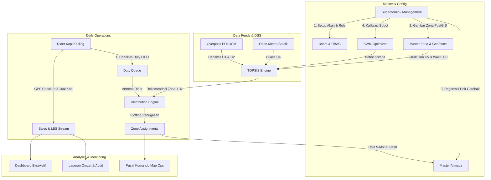

# 🗺️ Peta Alur Sistem COZIS (MantaKopi DSS)

Dokumen ini merupakan indeks dan ringkasan arsitektur alur kerja (*system workflows*) yang telah diimplementasikan pada sistem **COZIS (Coffee Zone Intelligence System - MantaKopi DSS)** berbasis runtime **Bun 1.4 + Svelte 5 + PostgreSQL PostGIS + Redis LBS**.

---

## 📑 Daftar Alur & Use Case Sistem

Setiap dokumen di dalam folder `flow/` menjelaskan alur operasional sistem secara terperinci dengan format standar: **Actors, Pre-conditions, Post-conditions, Basic Path, Alternative Path, dan Exceptional Path**.

| No | Nama Dokumen Flow | Deskripsi Singkat Konteks | Aktor Utama |
|:---:|:---|:---|:---|
| 1 | [01. Autentikasi & Manajemen Pengguna](flow_auth_dan_pengguna.md) | Login JWT, aktivasi akun, reset sandi mandiri & admin, serta hierarki RBAC (*Superadmin, Management, Supervisor, Rider*). | Semua Pengguna, Admin |
| 2 | [02. Manajemen Zona & Spasial GIS](flow_zona_spasial_gis.md) | Digitasi poligon PostGIS, validasi larangan jalan tol & protokol, buffer Central HUB 12 KM, dan monitoring peta live. | Superadmin, Supervisor |
| 3 | [03. DSS Engine: BWM & TOPSIS](flow_dss_bwm_topsis.md) | Kalibrasi bobot Best-Worst Method (BWM), penilaian 6 kriteria (C1-C6), dan perangkingan zona dinamis per slot waktu. | Superadmin, Sistem DSS |
| 4 | [04. Manajemen Master Armada & Lock 5-Menit](flow_armada_gerobak.md) | Master gerobak/e-bike, status perawatan bengkel, serta mekanisme *temporary hold* 5 menit sebelum klaim permanen. | Superadmin, Supervisor, Rider |
| 5 | [05. Distribusi & Plotting Rute](flow_distribusi_dan_plotting.md) | Antrean tugas harian FIFO (*Duty Queue*), algoritma auto-plotting rekomendasi TOPSIS, dan plotting manual supervisor. | Supervisor, Superadmin |
| 6 | [06. Siklus Operasional Harian Rider](flow_operasional_rider.md) | Siklus kerja lengkap: Konfirmasi tugas $\rightarrow$ Hold/Klaim unit $\rightarrow$ Check-In GPS $\rightarrow$ Catat penjualan $\rightarrow$ Checkout & kembalikan armada. | Rider, Sistem LBS |
| 7 | [07. Laporan, Audit Log & Notifikasi](flow_laporan_audit_notifikasi.md) | Agregasi omzet penjualan harian/bulanan, rekaman audit jejak aktivitas (*OWASP*), pusat notifikasi, dan auto-cron satelit. | Management, Superadmin, Cron |
| 8 | [08. Onboarding Organisasi & Lifecycle](flow_onboarding_dan_lifecycle.md) | Onboarding bertingkat (*No Public Registration*), pemisahan *Account Provisioning vs Operational Assignment*, dan 5-tahap lifecycle akun. | Superadmin, Management, Supervisor |

---

## 🏗️ Gambaran Interaksi Antar Modul (Big Picture)

---

## 💡 Prinsip Desain & Integritas Data
1. **Keamanan**: Seluruh password di-hash menggunakan native `Bun.password` (Bcrypt cost 10).
2. **Validasi Spasial**: Geometri PostGIS `ST_Intersects` memastikan gerobak dilarang melintasi ruas jalan tol.
3. **Konkurensi Armada**: Sistem lock 5-menit mencegah perebutan unit armada yang sama oleh dua rider sekaligus.
4. **Data Transparan**: Seluruh data pada dashboard dan laporan bersumber langsung dari database tanpa mock statis.
