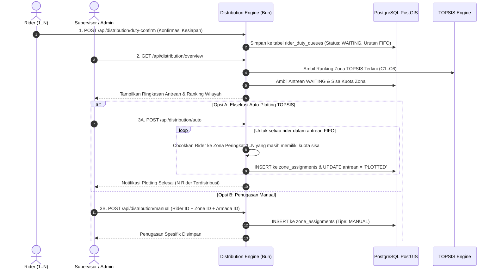

# 📈 Alur 05: Distribusi Rute & Plotting Tugas Rider

Dokumen ini menjelaskan alur kerja penjadwalan dan distribusi rider harian, mulai dari konfirmasi kesediaan tugas ke antrean *First-In-First-Out (FIFO)*, algoritma pencocokan otomatis (*Auto-Plotting*) berbasis rekomendasi SPK TOPSIS, hingga penugasan manual oleh Supervisor.

---

## 👥 1. Identifikasi Aktor & Peran (*Actors*)

1. **Rider**: Mengonfirmasi kehadiran dan kesiapan bertugas pada hari tersebut melalui aplikasi mobile / web.
2. **Supervisor / Superadmin**: Meninjau antrean tugas rider yang masuk, mengeksekusi distribusi otomatis berbasis TOPSIS, atau memetakan rider secara manual ke zona tertentu.
3. **Mesin Distribusi (Distribution Engine)**: Menggabungkan antrean FIFO rider dengan daftar ranking zona hasil perhitungan SPK TOPSIS serta kuota kapasitas zona (`max_capacity`).

---

## 🔄 2. Diagram Alur Plotting Distribusi



---

## 🎯 3. Use Case 5.1: Konfirmasi Kesediaan Tugas Rider (*Duty Check-In FIFO*)

### A. Pre-conditions
- Rider berstatus aktif dan telah login ke akun pribadinya.
- Berada pada hari operasional berjalan (`duty_date = CURRENT_DATE`).

### B. Post-conditions
- Rider terdaftar dalam tabel `rider_duty_queues` dengan status `WAITING` dan waktu konfirmasi presisi milidetik.

### C. Basic Path
1. Rider membuka aplikasi di pagi hari dan menekan tombol **"Konfirmasi Siap Bertugas Hari Ini"**.
2. Aplikasi mengirimkan request `POST /api/distribution/duty-confirm`.
3. Backend mencatat entri pada tabel `rider_duty_queues`:
   ```sql
   INSERT INTO rider_duty_queues (rider_id, duty_date, confirmed_at, status)
   VALUES ($1, CURRENT_DATE, CURRENT_TIMESTAMP, 'WAITING')
   ON CONFLICT (rider_id, duty_date) DO UPDATE 
   SET status = 'WAITING', confirmed_at = CURRENT_TIMESTAMP;
   ```
4. Aplikasi menampilkan nomor urut antrean rider dan status *"Menunggu Plotting Rute"*.

---

## 🎯 4. Use Case 5.2: Eksekusi Auto-Plotting Berbasis TOPSIS (`/distribution`)

### A. Pre-conditions
- Terdapat rider dalam antrean berstatus `WAITING`.
- Terdapat zona operasional aktif yang masih memiliki sisa kuota kapasitas (`remaining_capacity > 0`).
- Supervisor atau Superadmin membuka halaman `/distribution`.

### B. Post-conditions
- Seluruh rider dalam antrean terpetakan ke zona terbaik berdasarkan ranking TOPSIS.
- Status antrean berubah menjadi `PLOTTED`.
- Baris penugasan baru dibuat di tabel `zone_assignments` dengan `assignment_type = 'AUTO'`.

### C. Basic Path (Algoritma Pencocokan FIFO + TOPSIS)
1. Supervisor membuka halaman Pusat Distribusi `/distribution`.
2. Halaman menampilkan:
   - Jumlah rider standby dalam antrean FIFO.
   - Peringkat zona prioritas berdasarkan TOPSIS slot waktu saat ini.
   - Sisa kuota masing-masing zona.
3. Supervisor menekan tombol **"Eksekusi Auto Plotting TOPSIS"**.
4. Frontend mengirim request `POST /api/distribution/auto`.
5. Backend menjalankan algoritma alokasi:
   - Mengambil antrean rider berstatus `WAITING` terurut berdasarkan `confirmed_at ASC` (yang datang lebih awal mendapat prioritas).
   - Mengambil zona terurut berdasarkan skor kedekatan relatif TOPSIS ($C_i$ tertinggi ke terendah).
   - Mengisi zona peringkat #1 hingga kuota maksimalnya penuh, kemudian melanjutkan ke zona peringkat #2, dan seterusnya.
   - Menyimpan penugasan ke tabel `zone_assignments` dan menandai status antrean menjadi `PLOTTED`.
6. Backend merespons jumlah total rider yang berhasil di-plot beserta rincian penugasannya.
7. Frontend memperbarui tabel penugasan aktif seketika (*live update*).

### D. Alternative Path: Penugasan Manual Spesifik (*Manual Override*)
1. Jika Supervisor ingin menugaskan rider tertentu ke zona khusus (misal: rider berpengalaman untuk zona event khusus):
2. Supervisor menekan tombol **"Penugasan Manual"**.
3. Form modal terbuka: Supervisor memilih nama Rider, memilih Zona Tujuan, dan memilih Unit Armada (opsional).
4. Supervisor menekan **"Simpan Penugasan"** $\rightarrow$ API `POST /api/distribution/manual` dieksekusi dengan `assignment_type = 'MANUAL'`.
5. Penugasan manual tercatat dan kuota zona otomatis berkurang 1 slot.

### E. Exceptional Path: Kapasitas Seluruh Zona Telah Penuh
- Jika total rider yang mendaftar melebihi kapasitas gabungan seluruh zona di Sidoarjo:
  - Rider yang berada di urutan antrean paling belakang tetap berstatus `WAITING`.
  - Sistem memberikan laporan: *"4 rider berhasil di-plot, 2 rider belum teralokasi karena seluruh kuota zona telah terisi penuh."*
  - Supervisor dapat menambah kuota `max_capacity` pada zona tertentu atau mengarahkan pembukaan zona baru.
