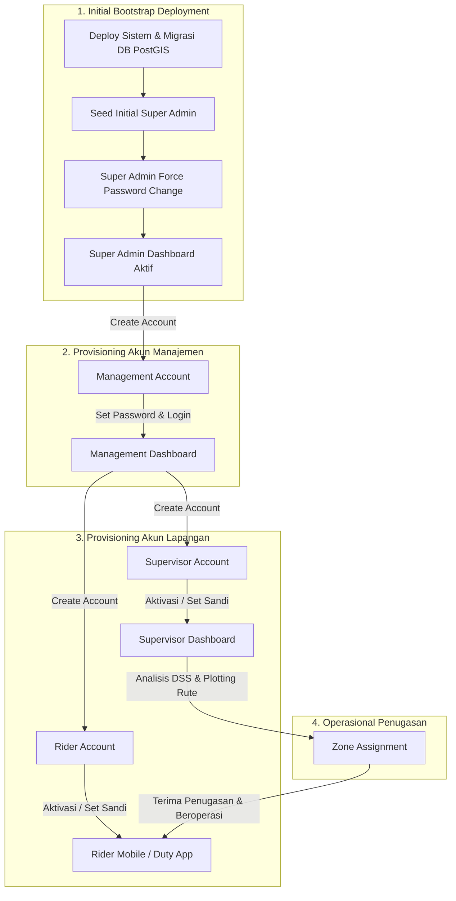

# 🚀 Alur 08: Onboarding Organisasi & Lifecycle Pengguna

Dokumen ini menjelaskan alur *onboarding* bertingkat (*Tiered Organizational Provisioning*) dan siklus hidup akun pengguna (*User Lifecycle*) pada sistem internal perusahaan **COZIS (MantaKopi DSS)** berdasarkan panduan arsitektur [`ONBOARDING.md`](file:///f:/project_zero/md/ONBOARDING.md).

---

## 🏛️ 1. Prinsip Utama Onboarding Sistem Internal
1. **No Public Registration (Private Corporate DSS)**: COZIS adalah sistem operasional internal perusahaan kopi keliling, bukan aplikasi publik/SaaS terbuka. Tidak disediakan registrasi bebas bagi pihak luar.
2. **Pemisahan Tanggung Jawab (*Separation of Concerns*)**:
   - **Account Management (Provisioning)**: Dimiliki oleh **Super Admin & Management** (*"Siapa yang memiliki hak akses akun ke dalam sistem"*).
   - **Operational Assignment (Plotting)**: Dimiliki oleh **Supervisor** (*"Rider bertugas di zona wilayah mana hari ini"*).
3. **5 Tahap Siklus Hidup Akun (*User Lifecycle*)**:
   $$\text{Provision} \longrightarrow \text{Activate} \longrightarrow \text{Assign} \longrightarrow \text{Operate} \longrightarrow \text{Deactivate}$$

---

## 👥 2. Identifikasi Aktor & Tanggung Jawab Onboarding (*Actors*)

| Aktor | Peran Utama Onboarding | Tanggung Jawab dalam Lifecycle |
|:---|:---|:---|
| **Super Admin** | *Bootstrap Root Administrator* | Inisialisasi sistem, konfigurasi master parameter SPK/GIS, dan membuat akun level Management. |
| **Management** | *Account Provisioning Layer* | Mengelola pembuatan akun operasional harian (Supervisor & Rider), master armada, dan katalog produk. |
| **Supervisor** | *Operational Planner* | Mengakses rekomendasi DSS BWM/TOPSIS, mengatur zona wilayah, dan melakukan plotting penugasan rider. |
| **Rider** | *Field Operator* | Menerima akun dari Management, mengonfirmasi tugas, mengklaim armada di Hub, dan menjual kopi di zona. |

---

## 🏗️ 3. Diagram Alur Provisioning Organisasi

---

## 🎯 4. Use Case 8.1: Initial Bootstrap & Onboarding Super Admin

### A. Pre-conditions
- Server backend Bun dan database PostgreSQL PostGIS baru saja di-deploy ke lingkungan staging/production.
- Database telah menjalankan skema migrasi tabel awal.

### B. Post-conditions
- Akun Super Admin pertama aktif dengan kata sandi unik yang aman.
- Konfigurasi sistem dasar (`system_settings`) seperti koordinat Central HUB Sidoarjo terpasang.

### C. Basic Path
1. Tim DevOps / Lead Engineer menjalankan perintah seed awal: `bun src/scripts/seed.ts`.
2. Sistem membuat akun Super Admin pertama (`superadmin@kopikeliling.com`) dengan kredensial acak / temporary hash.
3. Super Admin melakukan login pertama kali di `/login`.
4. Sistem mendeteksi `first_login === true` atau meminta pembaruan sandi default.
5. Super Admin diarahkan ke form penggantian kata sandi wajib (*Force Set Password*).
6. Super Admin memasukkan kata sandi produksi baru yang kuat (minimal 8 karakter, kombinasi huruf besar, angka, dan simbol).
7. Kata sandi di-hash menggunakan native `Bun.password.hash(..., { algorithm: "bcrypt", cost: 10 })`.
8. Super Admin masuk ke Executive Dashboard dan siap membuat akun Management.

---

## 🎯 5. Use Case 8.2: Onboarding Akun Management oleh Super Admin

### A. Pre-conditions
- Super Admin login dan membuka menu **Manajemen Pengguna** (`/users`).

### B. Post-conditions
- Akun Management tersimpan di tabel `users` dengan `role = 'MANAGEMENT'` dan `is_active = true`.
- Undangan aktivasi terkirim ke email pengguna Management.

### C. Basic Path
1. Super Admin menekan tombol **"Tambah Pengguna Baru"**.
2. Super Admin mengisi Nama Lengkap, Email Kantor, Username, dan memilih role **`MANAGEMENT`**.
3. Super Admin menekan **"Generate Sandi Acak"** dan menekan **"Simpan Pengguna"**.
4. Backend menyimpan akun dan mencatat log `USER_CREATE_MANAGEMENT` di `audit_logs`.
5. Pengguna Management menerima kredensial/token aktivasi, membuka `/login`, dan masuk ke Dashboard Manajemen.

---

## 🎯 6. Use Case 8.3: Onboarding Supervisor & Rider oleh Management

### A. Pre-conditions
- Pengguna login sebagai **Management** (atau **Super Admin**).
- Mengakses halaman `/users`.

### B. Post-conditions
- Akun Supervisor atau Rider siap digunakan untuk operasional.
- Supervisor memperoleh hak akses ke modul DSS & Plotting, sedangkan Rider siap menerima antrean tugas.

### C. Basic Path: Pembuatan Akun Management / Supervisor / Rider
1. Super Admin / Management menekan tombol **"Tambah Pengguna Baru"**.
2. Super Admin / Management **hanya perlu mengisi 3 data esensial**:
   - **Nama Lengkap Personel** (misal: *Siti Rahmawati*)
   - **Alamat Email** (Gmail / Email Kantor riil, misal: *siti.supervisor@gmail.com*)
   - **Peran Akun (Role)** (*`MANAGEMENT`*, *`SUPERVISOR`*, atau *`RIDER`*)
3. Super Admin / Management menekan tombol **"Buat & Kirim Undangan"**.
4. **Backend System**:
   - Menghasilkan *username* unik otomatis dari alamat email.
   - Menyimpan akun di database PostgreSQL `users` dalam status menunggu aktivasi.
   - Menghasilkan token undangan unik berdurasi 48 jam.
   - Mengirimkan email undangan resmi via SMTP/Ethereal ke alamat email pengguna target berisi tautan aktivasi: `http://localhost:5173/register?token=<token>&email=<email>`.
5. Administrator disajikan konfirmasi sukses dilengkapi **Tautan Aktivasi Akun (Copyable Link)**.

### D. Alur Verifikasi Email & Aktivasi Akun oleh Pengguna (Staf / Rider):
1. Pengguna membuka kotak masuk email dan mengklik **"Aktivasi Akun Sekarang"**.
2. Halaman `/register` memvalidasi token, menampilkan identitas akun terverifikasi (**Email Terverifikasi**, Nama Personel, dan Role).
3. **Pengguna Melengkapi Data Identitas & Sandi**:
   - Memasukkan **Tanggal Lahir Personel** (`birth_date`) sebagai verifikasi identitas resmi.
   - Menentukan **Kata Sandi Baru** & konfirmasi sandi (atau memilih **"Aktivasi Instan dengan Akun Google"**).
4. Pengguna menekan **"Aktifkan Akun Saya"**.
5. Backend menyimpan kata sandi ter-hash (`bcrypt`), mencatat kolom `birth_date`, menandai token telah digunakan (`used = true`), dan mengaktifkan status akun (`is_active = true`).
6. Pengguna menerima konfirmasi aktivasi sukses dan langsung dapat melakukan **Login** (baik melalui form username/password maupun Google Sign-In).

---

## 🎯 7. Use Case 8.4: Siklus Penonaktifan & Pemutusan Akses (*Deactivation / Offboarding*)

### A. Pre-conditions
- Rider atau staf operasional mengundurkan diri, masa kontrak habis, atau akun terindikasi pelanggaran keamanan.
- Super Admin atau Management membuka halaman `/users`.

### B. Post-conditions
- Akun pengguna target berstatus `is_active = false`.
- Seluruh sesi login dan token JWT yang sedang aktif langsung dicabut (*revoked*).

### C. Basic Path
1. Admin mencari baris akun pengguna target pada tabel `/users`.
2. Admin menggeser saklar status akun menjadi **Nonaktif (Deactivated)**.
3. Backend mengeksekusi `PATCH /api/users/:id/status` dengan payload `{ is_active: false }`.
4. Backend otomatis menandai seluruh token pengguna di tabel `refresh_tokens` menjadi `revoked = true`.
5. Jika pengguna yang bersangkutan sedang membuka aplikasi di perangkatnya, *Axios Response Interceptor* mendeteksi status nonaktif pada request berikutnya dan otomatis me-log out pengguna (*forced logout*).
6. Pengguna tidak dapat login kembali ke sistem hingga diaktifkan ulang oleh Management/Super Admin.

---

## 🚨 8. Penanganan Kasus Pengecualian (*Exceptional Paths*)

1. **Percobaan Akses Form Registrasi Publik Tanpa Hak**:
   - Jika ada pihak luar mencoba mengakses endpoint registrasi mandiri:
   - Backend membatasi role default hanya sebagai pemohon `RIDER` dan akun wajib disetujui/diaktifkan secara manual oleh Management sebelum dapat digunakan.
2. **Management Mencoba Membuat Akun Super Admin (Pelanggaran RBAC)**:
   - Jika pengguna ber-role `MANAGEMENT` mencoba mengirim payload `{ role: 'SUPERADMIN' }`:
   - Backend `roleMiddleware` mencegat request dan merespons `403 Forbidden` (*"Akun Management tidak memiliki otoritas membuat akun Superadmin"*).
3. **Supervisor Mencoba Menghapus atau Mengubah Akun Pengguna**:
   - Supervisor **tidak memiliki menu `/users`**. Jika Supervisor mencoba menembak API `POST /api/users`, backend secara ketat menolak dengan error `403 Forbidden`.
